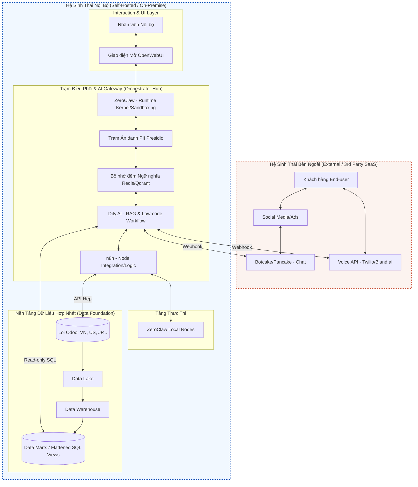

# Báo Cáo Chiến Lược Triển Khai Trí Tuệ Nhân Tạo (AI) Tập Đoàn

**Mục tiêu:** Cung cấp định hướng kiến trúc, lộ trình và phân tích giải pháp công nghệ để ứng dụng AI sâu rộng, an toàn và tối ưu chi phí vào vận hành doanh nghiệp đa quốc gia.

**Đối tượng:** Ban Giám đốc (C-Level), Trưởng bộ phận Nghiệp vụ (Business Heads) và Team AI/Tech.

---

## 1. Bối cảnh Doanh nghiệp

- **Quy mô:** ~300 nhân sự trực tiếp, quản lý tệp dữ liệu hơn 300,000 khách hàng (phần lớn là cá nhân).
- **Mô hình kinh doanh:** Thương mại điện tử kết hợp xuất nhập khẩu bán lẻ trên toàn cầu (Mỹ, Nhật, Hàn, Thái Lan, Việt Nam) với hệ thống fulfillment tại từng thị trường.
- **Hệ sinh thái Công nghệ:** Odoo đang là trục xương sống (ERP) cho quy trình Mua - Bán - Kho - Vận tải - Tài chính kế toán. Các hệ thống tiếp thị và tương tác bên ngoài gồm Facebook, Tiktok, Shopee, Lazada tích hợp qua Botcake/Pancake.
- **Nguồn lực Công nghệ:** Đội ngũ IT nội bộ tinh gọn với 14 chuyên viên (2 Data, 2 AI, 2 Dev core, 1 Infra, 4 BA).
- **Biến động sắp tới:** Dự án tái cấu trúc hạ tầng CNTT sẽ phân nhỏ lõi Odoo từ 1 hệ thống tập trung thành 5-6 instances độc lập theo từng pháp nhân quốc gia.

## 2. Vấn đề Cốt lõi & Thách thức

Biến động về cấu trúc ERP dẫn đến hệ quả pháp lý và hạ tầng dữ liệu nghiêm trọng nếu vội vàng ứng dụng AI:

1. **Phân mảnh dữ liệu (Data Fragmentation):** Sự phân tách thành nhiều instance Odoo triệt tiêu tính "Single Source of Truth". Kết nối AI trực tiếp vào từng Odoo instance sẽ gây ra sai lệch báo cáo (AI hallucination) khi suy luận chéo quốc gia.
2. **Kích thước Dữ liệu (Curse of Dimensionality):** Các mô hình ngôn ngữ lớn (LLM) không thể tiếp nhận trọn vẹn mô hình cơ sở dữ liệu quan hệ phức tạp, hàng tỷ bản ghi với hàng nghìn bảng của Odoo một cách chính xác.
3. **Bảo mật và Định danh (PII & Role-Based Access Control):** Dữ liệu kế toán, tài chính và hồ sơ cá nhân của khách hàng sẽ bị bộc lộ nếu cấp quyền cho Public LLM API đọc thẳng database không qua cơ chế ẩn danh. Tràn bộ nhớ đa người dùng (Context Bleed) có thể khiến nhân sự cấp dưới truy cập được số liệu của ban giám đốc.

## 3. Thiết kế Kiến trúc & Tách Lớp Hệ Thống

Để giải quyết bài toán trên, thiết kế hệ thống phải tuân thủ nghiêm ngặt mô hình **Trục bánh xe & Nan hoa (Hub-and-Spoke)**, tuân thủ nguyên lý tách biệt Tư duy và Thực thi (Decoupled Brain and Hands).

### 3.1 Biểu đồ Kiến trúc Tổng thể

*Nguyên lý cốt lõi:* Dữ liệu phải được làm phẳng (Flattened) tại Data Marts trước. AI Dify xử lý RAG Workflow, ZeroClaw cô lập runtime. Odoo giữ nguyên vai trò System of Record.

---

## 4. Báo cáo Thẩm định Công nghệ (Tech Due Diligence)

Lựa chọn công cụ quyết định tính sống còn của hạ tầng. Dưới đây là phân tích các nền tảng sau quá trình Due Diligence.

### 4.1 Khối Điều phối & Hạt nhân (Orchestration & Kernel)

| Nền tảng     | Chức năng cốt lõi                                          | Rủi ro                                                             | Đánh giá & Khuyến nghị                                                                                        |
| :----------- | :--------------------------------------------------------- | :----------------------------------------------------------------- | :------------------------------------------------------------------------------------------------------------ |
| **Dify.AI**  | LLMOps & RAG Engine. Thiết lập luồng workflow kéo-thả.     | Rủi ro rò rỉ cấu hình hệ thống nếu expose port trực tiếp.          | **Chấp thuận.** Đóng vai trò làm "Bộ não". Modular tốt, Model-agnostic (không bị khóa vào OpenAI hay Claude). |
| **ZeroClaw** | Agent Runtime Kernel viết bằng Rust. Dùng làm Sandbox.     | Lương kỹ sư Rust cao, khó tuyển dụng.                              | **Chấp thuận.** Làm "Lưới bảo vệ" đầu cuối nhờ tính năng chặn RCE và tiêu hao cực ít RAM (< 5MB).             |
| **OpenClaw** | Autonomous Agent có khả năng tự thao tác Terminal/Browser. | Lỗ hổng CVE nghiêm trọng (Command Injection, RCE). Phân quyền yếu. | **Loại bỏ (Reject)** khỏi Production. Chỉ cách ly dùng cho R&D đơn lẻ.                                        |

### 4.2 Khối Công cụ & Tính năng Bổ trợ (Tools & Integrations)

| Nền tảng       | Chức năng cốt lõi                                               | Rủi ro                                                                   | Đánh giá & Khuyến nghị                                                                                                            |
| :------------- | :-------------------------------------------------------------- | :----------------------------------------------------------------------- | :-------------------------------------------------------------------------------------------------------------------------------- |
| **Odoo AI**    | Tính năng AI nguyên bản tích hợp sẵn trong Odoo ERP.            | Kiến trúc Thin Wrapper, phụ thuộc LLM ngoài. Không có Vector DB nội tại. | **Chấp thuận có điều kiện.** Chỉ dùng cho System of Record và soạn thảo văn bản tĩnh. Không dùng làm não bộ điều phối.            |
| **Manus AI**   | Agentic AI (SaaS) trỏ chuột, lướt web, làm phân tích tự chủ.    | SaaS của Meta. Rủi ro mất PII khi tải dữ liệu lên hạ tầng đám mây đóng.  | **Chấp thuận có điều kiện.** Tuyệt đối không giao quyền API vào Database. Chỉ dùng cho R&D và truy vấn dữ liệu web công khai.     |
| **Perplexity** | AI Search Engine có trích dẫn nguồn thực để nghiên cứu báo cáo. | Rủi ro ảo giác thông tin và rò rỉ dữ liệu ở bản Free.                    | **Chấp thuận có điều kiện.** Mua bản Enterprise Pro ($40/month) để đáp ứng SOC2. Thay thế việc tự xây mô hình RAG nội bộ tốn kém. |

---

## 5. Danh Mục Các Use Case Trực Tiếp (Applied Use Cases)

Ứng dụng kiến trúc trên, tự động hóa được chia nhỏ thành các cụm tính năng thực tiễn có ROI cao.

### 5.1 Giao tiếp Đa kênh & Chăm sóc khách hàng (Messenger/Zalo/Web)
- **Bắt bệnh:** Chatbot thế hệ cũ trả lời tĩnh, làm mất lòng khách và tỷ lệ hoàn đơn cao.
- **Giải pháp (UC-01 & UC-02):** Onboarding khách qua kịch bản tự động theo các ngày D+0, D+3, D+7. Phân luồng kịch bản rẽ nhánh theo tệp Khách Mới (tập trung chốt Sale) và Khách Cũ (tập trung Resale/Cross-sell).
- **Ngắt mạch Khủng hoảng (UC-03):** Tích hợp Sentiment Analysis. Khi khách chửi bới, AI nhận diện và buộc dừng kịch bản bán hàng, xin lỗi và Handoff (Chuyển người thật) ngay lập tức. Cung cấp Dify RAG để trả lời linh hoạt khách hỏi xoáy ngoài kịch bản (FAQ).

### 5.2 Thoại Tự động (Inbound / Outbound Voice AI)
- **Bắt bệnh:** Telesales gọi điện tỷ lệ nhấc máy 10-20%, chi phí nhân sự quá lớn cho việc lọc tệp.
- **Giải pháp:** 
  - **Inbound (UC-01):** Khách gọi giữa đêm, AI nghe tức thì. Không cần phải chờ đợi nhạc chờ.
  - **Outbound (UC-02):** Gọi 1000 khách cũ để lọc tệp những ai quan tâm. Sales chỉ gọi chốt ở 20% danh sách đã được làm nóng (Warm leads).
  - **Khảo sát sau mua (UC-03):** AI gọi lấy Feedback trong 1-2 phút. Tiêu cực -> Báo CSKH xin lỗi khẩn. Tích cực -> Tặng voucher Mua qua Zalo.
  - **Xác nhận sự kiện:** Tự động gọi xác nhận 500 khách tham gia hội nghị trong 1 giờ.

### 5.3 Vận hành Nội bộ & Mạng Lưới Dữ Liệu (Internal Ops)
- **Bắt bệnh:** Sales quên nhập liệu, hoặc không đọc kỹ lịch sử báo cáo dẫn đến tư vấn lặp lại. Giám đốc thiếu số liệu "sống".
- **Giải pháp:**
  - **Tóm tắt tệp khách:** Sales gõ lệnh vào OpenWebUI, AI quét Call transcript, hệ thống tóm tắt "Nhu cầu cốt lõi" + Chấm điểm tiềm năng Lead.
  - **Auto Onboarding:** Tick deal "Won" trên CRM, AI tự tạo account, add Zalo, gửi email Welcome, cài reminder chăm sóc tự động.
  - **Voice of Customer (VoC) Dashboard:** Phân tích từ khóa tiêu cực trên diện rộng, tìm Root Cause (VD: "Shipper khu X làm chậm") và báo cáo trực quan cho Giám đốc theo ngày.
  - **ChatOps:** Trò chuyện với Bot để trực tiếp update trạng thái CRM khi đang đi ngoài đường, giữ dữ liệu luôn "Tươi" (Real-time).

---

## 6. Lộ trình Triển khai Tổng Thể (Master Roadmap)

Thực thi tuần tự 4 giai đoạn, không nhảy bước để phòng ngừa rủi ro tài chính và sụp đổ kỹ thuật.

### Giai đoạn 0: Xây nền Kiến trúc & Dữ liệu (Tháng 1-2)
- Khởi tạo Data Warehouse. Tạo ngay 3 luồng PostgreSQL Views phẳng (`v_ai_sales`, `v_ai_inventory`, `v_ai_crm`).
- Deploy Dify & ZeroClaw trên môi trường Dev nội bộ.
- **Nghiệm thu:** AI Data Analyst trả lời chính xác luồng dữ liệu Sales qua Chatbot nội bộ trong dưới 5 giây. Không bị ảo giác (Hallucination).

### Giai đoạn 1: Triển khai Chăm sóc Khách hàng Chat (Tháng 3-5)
- Định tuyến Dify và n8n vào Botcake. Cho phép AI tiếp quản 10% lượng tin nhắn thực tế để phân tích Intent.
- **Nghiệm thu:** Giảm 20% tải cho nhân viên chăm sóc khách hàng. Cơ cấu Handoff (chuyển cho người) hoạt động trong vòng 1s nếu độ tin cậy AI < 85%.

### Giai đoạn 2: Trợ lý Giọng nói & Vận hành Nội bộ (Tháng 6-9)
- Thiết lập hệ thống Voice AI (Twilio tự lưu trữ nếu vượt 3000 phút gọi/tháng).
- Tích hợp ZeroClaw Workers cho các tác vụ tóm tắt nội bộ (Lead summary) và Onboarding.
- **Nghiệm thu:** Tiết kiệm 80% thời gian telesale lọc rác. 

### Giai đoạn 3: Tối ưu và Quản trị Hệ sinh thái (Tháng 10-12)
- Áp dụng Semantic Caching (Redis/Qdrant) để tái sử dụng câu trả lời quen thuộc, giảm ngân sách LLM.
- **Nghiệm thu:** Giảm 40% chi phí định kỳ cho Token API. Mạng lưới AI vận hành trơn tru xuyên biên giới cho 5 instance Odoo mà không lọt data.

---

## 7. Đánh giá Công cụ (Tech Due Diligence)

Rủi ro và cách xử lý từng công cụ:

### 7.1. Orchestration & Sandbox
- **Dify.AI (Approve)**: Lỗi sơ đẳng là cấu hình Docker mặc định dễ bị bypass. **Giải pháp:** Đặt Dify sau API Gateway (Nginx/Kong). Đặt Random password cho Redis/PostgreSQL. Mở RBAC nghiêm ngặt.
- **ZeroClaw (Approve)**: Nút thắt là con người. Rust an toàn nhưng khó học. **Giải pháp:** Giao Rust cho Core Team. Đẩy logic kinh doanh sang Python/Node.js qua microservices.
- **OpenClaw (Reject ở Production)**: Lỗi bảo mật nặng (CVE RCE, Command injection). **Giải pháp:** Chỉ dùng cho R&D. Buộc chạy trong Air-gapped Sandbox.

### 7.2. Feature Integrations
- **Manus AI (Conditional Approve)**: Rủi ro rò rỉ dữ liệu nội bộ lên cloud của Meta. **Giải pháp:** Chỉ cho phép tra cứu web công cộng. Cấm đưa PII vào prompt. Chặn quyền commit code trực tiếp (bắt buộc Human Review).
- **Perplexity AI (Conditional Approve)**: Cấm dùng bản Free. Nó lấy dữ liệu để train AI. **Giải pháp:** Mua bản Enterprise Pro ($40/tháng) để tuân thủ SOC2. Vẫn cần người thật kiểm tra lại trích dẫn (SOP).
- **Odoo AI (Conditional Approve)**: Odoo là System of Record tốt, nhưng AI tích hợp chậm chạp (1 năm update 1 lần). **Giải pháp:** Chỉ dùng Odoo để chứa cục data sạch. Rút logic AI sang Middleware.

---

## 8. Nợ Kỹ Thuật & Giới Hạn Cứng

Bốn nguyên tắc ngắt mạch bắt buộc:

1. **Rào Cản PII:** Đặt trạm Scrubber Processor (Presidio/Local NLP) ở cửa ngõ. Mọi chuỗi nhạy cảm phải bị đè thành `[REDACTED]` trước khi chạm internet.
2. **Đánh Dấu Độ Trễ:** Gắn biến `last_synced_time` vào mọi prompt quản lý. Nếu quá trình đồng bộ Odoo -> DWH trễ quá 1 giờ: cấm AI ra lệnh liên quan dòng tiền.
3. **Cô Lập Môi Trường:** Không cấp đặc quyền root cho bất kỳ Agent nào. Giới hạn Manus AI ở mức Market Research mù.
4. **Cô Lập Đặc Quyền Odoo:** AI chỉ được phép ghi qua các endpoint hẹp của n8n. Không giao quyền Super Admin. RBAC thủng là dừng dự án.

---

## 9. Kịch Bản Khủng Hoảng (Stress-Testing Protocols)

Cách xử lý cho 5 điểm mù chết người của hệ thống.

### 9.1. Đứt Cáp, Dữ Liệu Lệch Pha
- **Vấn đề:** Mất đồng bộ Odoo và Data Warehouse. AI đọc data cũ, báo sai giá.
- **Cách xử lý:** 
  - Khớp SLA. Trễ tín hiệu quá 15 phút, ngắt RAG.
  - Biến `[fresh_validate]` nếu fail, AI phải trả lời: "Hệ thống bảo trì, tôi chuyển máy cho CSKH." Bắt buộc Handoff.

### 9.2. Đốt Token API
- **Vấn đề:** Lưu lượng tăng gấp 10 đợt Flash Sale. Token API cạn tiền.
- **Cách xử lý:**
  - Bật Semantic Caching trước cổng Dify. Các câu lặp lại ("giá sao", "phí ship") lấy thẳng từ Cache, tốn 0đ.
  - LLM (GPT-4o/Claude) chỉ giải quyết các truy vấn yêu cầu suy luận phức tạp.

### 9.3. Rò Rỉ Data Qua Cloud
- **Vấn đề:** Sales ném lịch sử mua hàng, thẻ tín dụng của VIP lên cửa sổ chat AI.
- **Cách xử lý:**
  - Chạy PII Scrubber Analyzer offline làm tầng đánh chặn. Thông tin thẻ bị cào sạch trước khi đến server OpenAI.
  - Xoay API key định kỳ. Khóa IP đầu ra.

### 9.4. Độ Trễ Giọng Nói
- **Vấn đề:** Xử lý mất 5 giây (STT -> LLM -> TTS). Khách tưởng cúp máy.
- **Cách xử lý:**
  - Đổi HTTP standard sang WebSocket. Khóa độ trễ trần ở mức 1.5 giây.
  - Cài Silence Detection. Nếu mạng lag, phát audio đệm thu sẵn: "Tôi đang kiểm tra..." để giữ chân khách.

### 9.5. Chéo Dữ Liệu Phân Quyền
- **Vấn đề:** Nhân viên Marketing rút được báo cáo lợi nhuận của Giám đốc thông qua RAG.
- **Cách xử lý:**
  - Build mỗi User thành 1 container kín (OpenWebUI + ZeroClaw).
  - Gắn `metadata_filter` cứng vào Vector Search. Nhân sự phòng ban nào chỉ được chọc vào vùng dữ liệu phòng ban đó. Database CEO để ở cụm vật lý riêng.
