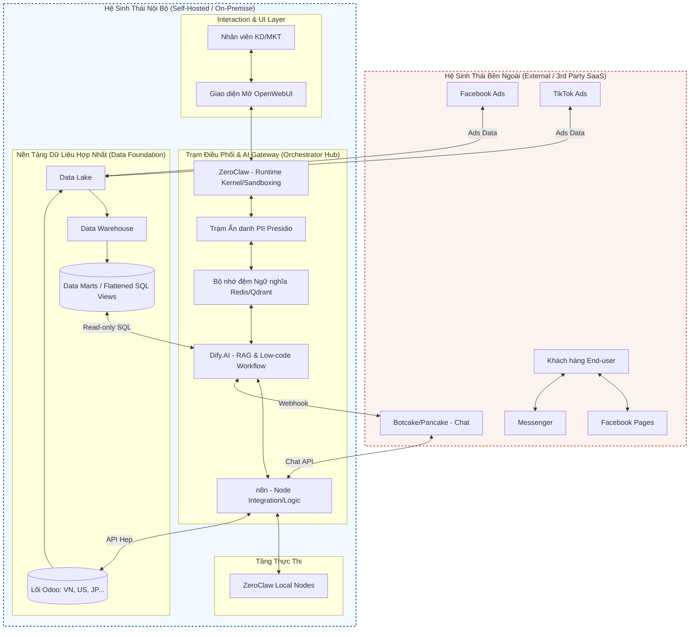
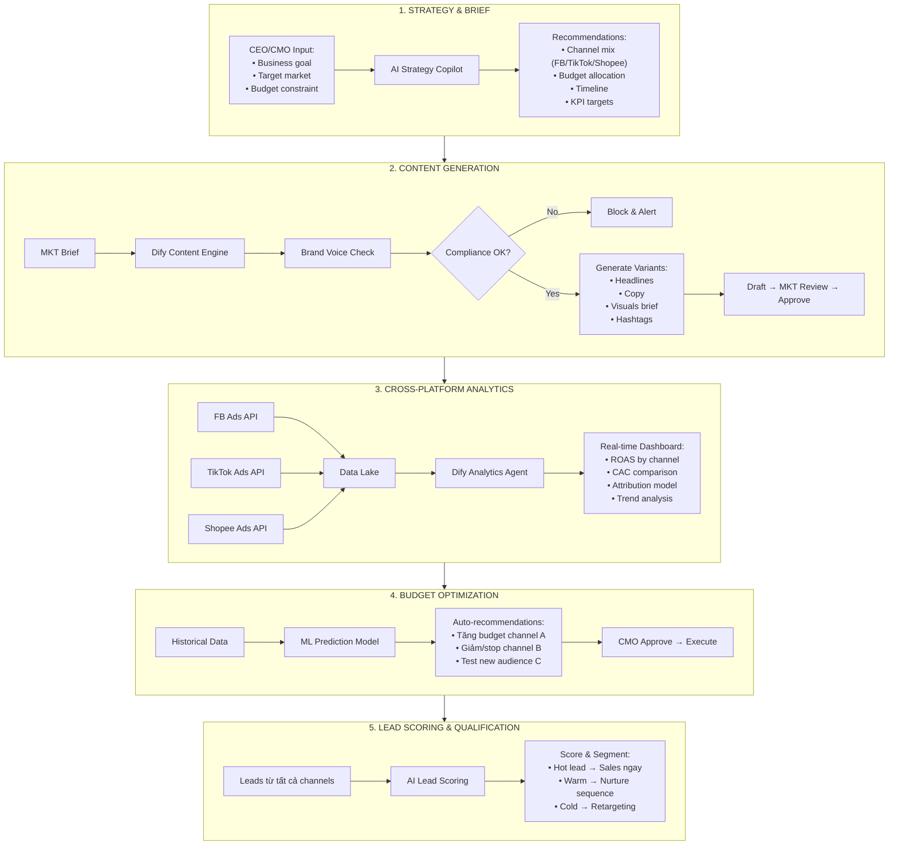
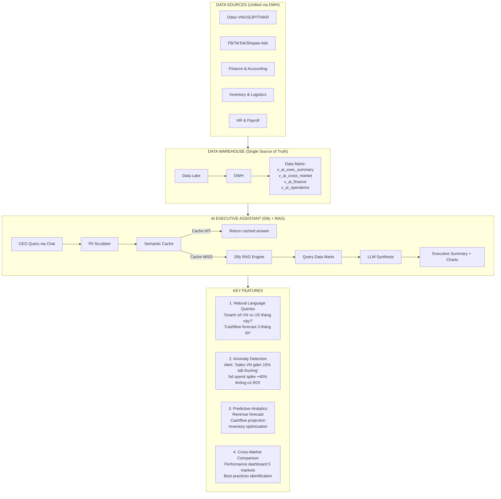

# Báo Cáo Chiến Lược Triển Khai Trí Tuệ Nhân Tạo (AI) Tập Đoàn

**Mục tiêu năm nay:** Triển khai 2 bài toán AI mang lại ROI trực tiếp và đo lường được:
1. **AI Assistant cho Flow Marketing:** Tối ưu điểm chạm đầu tiên trong Customer Journey - nơi doanh nghiệp chi tiền đầu tiên, tạo hiệu ứng lan tỏa dọc theo toàn bộ funnel.
2. **AI Assistant cho CEO & Tổng Giám đốc:** Tổng hợp thông tin doanh nghiệp từ các nền tảng đã kết nối, hỗ trợ ra quyết định chính xác và kịp thời.

**Đối tượng:** Ban Giám đốc (C-Level), Trưởng bộ phận Nghiệp vụ (Business Heads) và Team AI/Tech.

---

## 1. Bối cảnh Doanh nghiệp

- **Quy mô:** ~300 nhân sự trực tiếp, quản lý tệp dữ liệu hơn 300,000 khách hàng (phần lớn là cá nhân).
- **Mô hình kinh doanh:** Thương mại điện tử kết hợp xuất nhập khẩu bán lẻ trên toàn cầu (Mỹ, Nhật, Hàn, Thái Lan, Việt Nam) với hệ thống fulfillment tại từng thị trường.
- **Hệ sinh thái Công nghệ:** Odoo đang là trục xương sống (ERP) cho quy trình Mua - Bán - Kho - Vận tải - Tài chính kế toán. Các hệ thống tiếp thị và tương tác bên ngoài gồm Facebook, Tiktok, Shopee, Lazada tích hợp qua Botcake/Pancake.
- **Nguồn lực Công nghệ:** Đội ngũ IT nội bộ tinh gọn với 14 chuyên viên (2 Data, 2 AI, 2 Dev core, 1 Infra, 4 BA).
- **Biến động sắp tới:** Dự án tái cấu trúc hạ tầng CNTT sẽ phân nhỏ lõi Odoo từ 1 hệ thống tập trung thành 5-6 instances độc lập theo từng pháp nhân quốc gia.

## 2. Vấn đề Cốt lõi & Thách thức

Biến động về cấu trúc ERP dẫn đến hệ quả pháp lý và hạ tầng dữ liệu nghiêm trọng nếu vội vàng ứng dụng AI:

1. **Phân mảnh dữ liệu (Data Fragmentation):** Sự phân tách thành nhiều instance Odoo triệt tiêu tính "Single Source of Truth". Kết nối AI trực tiếp vào từng Odoo instance sẽ gây ra sai lệch báo cáo (AI hallucination) khi suy luận chéo quốc gia.
2. **Kích thước Dữ liệu (Curse of Dimensionality):** Các mô hình ngôn ngữ lớn (LLM) không thể tiếp nhận trọn vẹn mô hình cơ sở dữ liệu quan hệ phức tạp, hàng tỷ bản ghi với hàng nghìn bảng của Odoo một cách chính xác.
3. **Bảo mật và Định danh (PII & Role-Based Access Control):** Dữ liệu kế toán, tài chính và hồ sơ cá nhân của khách hàng sẽ bị bộc lộ nếu cấp quyền cho Public LLM API đọc thẳng database không qua cơ chế ẩn danh. Tràn bộ nhớ đa người dùng (Context Bleed) có thể khiến nhân sự cấp dưới truy cập được số liệu của ban giám đốc.

## 3. Thiết kế Kiến trúc & Tách Lớp Hệ Thống

Để giải quyết bài toán trên, thiết kế hệ thống phải tuân thủ nghiêm ngặt mô hình **Trục bánh xe & Nan hoa (Hub-and-Spoke)**, tuân thủ nguyên lý tách biệt Tư duy và Thực thi (Decoupled Brain and Hands).

### 3.1 Biểu đồ Kiến trúc Tổng thể

*Nguyên lý cốt lõi:* Dữ liệu phải được làm phẳng (Flattened) tại Data Marts trước. AI Dify xử lý RAG Workflow, ZeroClaw cô lập runtime. Odoo giữ nguyên vai trò System of Record.

### 3.2 Các Quyết định Kiến trúc (Architectural Decisions)

Tại sao không tích hợp AI trực tiếp vào từng Odoo instance? Tại sao cần tầng Data Warehouse trung gian?

| Câu hỏi Phản biện | Trả lời & Lý do Kiến trúc |
| :--- | :--- |
| **Tại sao không kết nối AI thẳng vào Odoo?** | LLM không thể hiểu mô hình quan hệ phức tạp với 1000+ bảng của Odoo. Risk: AI "ảo giác" khi join sai bảng, báo cáo sai lệch. **Giải pháp:** Làm phẳng dữ liệu qua SQL Views (`v_ai_sales`, `v_ai_crm`) trước khi AI đọc. |
| **Tại sao cần Data Warehouse khi đã có Odoo?** | 5-6 instance Odoo phân tán = không có "Single Source of Truth". **Giải pháp:** DWH hợp nhất dữ liệu từ tất cả pháp nhân, tạo context duy nhất cho AI suy luận chéo quốc gia. |
| **Tại sao tách "Bộ não" (Dify) khỏi "Thực thi" (n8n/Odoo)?** | Nếu AI có quyền ghi trực tiếp DB, một lỗi hallucination có thể xóa dữ liệu thật. **Giải pháp:** Dify chỉ đọc (Read-only). n8n thực thi qua API hẹp có audit log. |
| **Tại sao cần ZeroClaw thay vì chạy Agent trực tiếp?** | Python Agent truyền thống tốn 500MB+ RAM, dễ bị RCE. **Giải pháp:** ZeroClaw (Rust) tiêu hao <5MB, sandbox nghiêm ngặt, chặn mã độc từ xa. |
| **Tại sao cần PII Scrubber trước Dify?** | Khách hàng có thể chat số thẻ, thông tin cá nhân trên Messenger. **Giải pháp:** Trạm Presidio ẩn danh dữ liệu thành `[REDACTED]` trước khi ra internet. |
| **Tại sao cần Semantic Cache?** | 80% câu hỏi lặp lại ("giá sao", "ship bao lâu"). Không cache = đốt token. **Giải pháp:** Redis/Qdrant cache câu trả lời quen thuộc, giảm 40% chi phí API. |

### 3.3 Stress Test & Cơ chế Xử lý Deflection

Kiến trúc phải trả lời được 5 câu hỏi phản biện khó (Deflection Questions) từ Ban Giám đốc trước khi phê duyệt:

---

#### 🔴 Deflection #1: "AI đề xuất sai chiến lược marketing, gây lãng phí ngân sách - Làm sao kiểm soát?"

| Bước | Cơ chế xử lý |
|------|--------------|
| **1** | Confidence score <80% → Không tự động recommend, queue cho MKT review |
| **2** | AI chỉ recommend khi có đủ historical data (min 30 days) |
| **3** | Mọi recommendation đều phải có data source citation |
| **4** | Nếu market condition thay đổi đột ngột → Warning "Dữ liệu có thể không còn chính xác" |

- **Component:** Dify Workflow node `confidence_check` + `data_validation`
- **SLA cam kết:** 100% recommendations có source citation, 0% auto-execute without human approval
- **Audit:** Log mọi recommendations và outcomes để improve model

---

#### 🔴 Deflection #2: "Campaign tăng đột biến, chi phí LLM API tăng cao - Hệ thống có chịu tải được không?"

| Bước | Cơ chế xử lý |
|------|--------------|
| **1** | Hash query → tra cache trước khi gọi LLM |
| **2** | Cache HIT (câu hỏi lặp lại): Trả về ngay, tốn 0đ token |
| **3** | Cache MISS: Gọi LLM, lưu kết quả vào cache |
| **4** | Rate Limiter: Max 100 req/min per user |
| **5** | Circuit Breaker: Nếu quota API sắp hết → chỉ trả cache, alert admin |

- **Hiệu quả:** 70% queries là câu hỏi lặp lại → Giảm 50% chi phí token
- **Component:** Redis cluster trước cổng Dify
- **Fallback:** Nếu cache down → Queue request, xử lý khi cache recover

---

#### 🔴 Deflection #3: "CEO hỏi thông tin nhạy cảm, AI tiết lộ ra ngoài - Data leak?"

| Bước | Cơ chế xử lý |
|------|--------------|
| **1** | Mỗi user login → ZeroClaw tạo session container riêng |
| **2** | RBAC strict: CEO → toàn quyền, CFO → Finance data, MKT → Marketing data only |
| **3** | Query log → Audit trail đầy đủ, ai hỏi gì, khi nào |
| **4** | Alert nếu detect query nhạy cảm từ user không có quyền |
| **5** | Response không chứa data ngoài scope của user |

- **Component:** ZeroClaw (container isolation) + RBAC layer
- **Bảo mật:** Mọi query phải qua RBAC check, fail → block + alert
- **Audit:** Log mọi query vào SIEM, report weekly cho Security Champion

---

#### 🟡 Deflection #4: "AI tạo Ads content sai thương hiệu, chạy quảng cáo lỗi — Làm sao phòng ngừa?"

| Bước | Cơ chế xử lý |
|------|--------------|
| **1** | Brand Voice Check: AI so sánh content với template đã approve |
| **2** | Keywords blacklist: "khuyên dùng", "chữa khỏi", "cam kết" → Block ngay |
| **3** | Confidence score <85% → Yêu cầu MKT review trước khi publish |
| **4** | Draft mode: AI chỉ tạo draft, không auto-publish, MKT phải approve |

- **Tech:** Dify Workflow với validation rules
- **Monitoring:** Dashboard track % content bị reject, alert nếu >10%
- **Fallback:** Nếu AI không đủ confidence → "Tôi cần thêm thông tin về target audience"

---

#### 🔴 Deflection #5: "MKT Manager hỏi AI, AI trả lời số liệu của market khác — Data leak?"

| Bước | Cơ chế xử lý |
|------|--------------|
| **1** | Mỗi user login → ZeroClaw tạo session container riêng |
| **2** | Vector Search gắn `metadata_filter` theo role/markets |
| **3** | MKT Vietnam → chỉ search trong `v_ai_mkt_vietnam` |
| **4** | MKT US → chỉ search trong `v_ai_mkt_us` |
| **5** | C-Level → toàn quyền |
| **6** | Nếu RBAC fail → BLOCK toàn bộ, dừng dự án |

- **Component:** ZeroClaw (container isolation) + Qdrant (metadata filtering)
- **Test:** Load test 14 concurrent users khác team, verify 0 data leak
- **Nghiệm thu:** RBAC không đạt = không deploy Production

---

### 3.4 Ma trận Rủi ro & Giải pháp Kiến trúc

| Rủi ro | Mức độ | Component chịu trách nhiệm | Cơ chế xử lý |
| :--- | :---: | :--- | :--- |
| **Recommendation sai** | 🔴 Critical | Dify Workflow | Confidence <80% → Require human review, source citation |
| **Chi phí API** | 🟡 High | Redis/Qdrant Cache | Circuit Breaker, Rate Limiter |
| **Hallucination** | 🔴 Critical | Dify RAG + Confidence Score | Require source citation, human review for critical decisions |
| **Data Leak (RBAC fail)** | 🔴 Critical | ZeroClaw + RBAC | Strict RBAC, audit all queries, alert on violation |
| **Context Bleed** | 🟡 High | ZeroClaw + Qdrant | Container isolation + metadata_filter |
| **Brand Voice Violation** | 🟡 High | Dify Content Validation | Keywords blacklist, Draft mode, MKT approval |
| **Forecast sai** | 🟡 High | ML Model + Confidence Interval | Show confidence %, require validation for high-stakes decisions |

---

## 4. Báo cáo Thẩm định Công nghệ (Tech Due Diligence)

Lựa chọn công cụ quyết định tính sống còn của hạ tầng. Chi tiết đầy đủ tại `report-research/data/tools/`.

### 4.1 Tổng hợp Nền tảng & Khuyến nghị

| Nền tảng | Vai trò | Điểm (1-5) | Rủi ro chính | Khuyến nghị | Giải pháp Mitigation |
| :--- | :--- | :---: | :--- | :---: | :--- |
| **Dify.AI** | Bộ não (RAG/Workflow) | 4.5 | CVE cấu hình Docker | ✅ **Approve** | Đặt sau API Gateway, random password DB, bật RBAC |
| **ZeroClaw** | Sandbox/Kernel | 4.5 | Lương kỹ sư Rust cao | ✅ **Approve** | Core Team giữ Rust, logic business push sang Python/Node |
| **OpenClaw** | Autonomous Agent | 2.0 | CVE RCE, Command Injection | ❌ **Reject** | Chỉ R&D trong Air-gapped Sandbox |
| **Odoo AI** | System of Record | 3.5 | Thin Wrapper, update chậm | ⚠️ **Conditional** | Chỉ chứa data sạch, AI logic sang Middleware |
| **Manus AI** | Agentic Research | 3.0 | Rò rỉ PII lên cloud Meta | ⚠️ **Conditional** | Chỉ web công khai, cấm PII, bắt buộc Human Review |
| **Perplexity** | AI Search/Research | 4.5 | Bản Free train trên data | ⚠️ **Conditional** | Mua Enterprise Pro ($40/tháng) để SOC2 |

### 4.2 Chi phí Tổng thể (TCO) ước tính

| Hạng mục | Chi phí | Ghi chú |
| :--- | :--- | :--- |
| **Dify Self-hosted** | $50-500/tháng | Infra AWS/GCP (PostgreSQL, Redis, Qdrant) |
| **Perplexity Enterprise Pro** | $40/người/tháng | SOC2 compliant, không train trên data |
| **Perplexity Enterprise Max** | $325/người/tháng | Unlimited research |
| **Manus AI** | $19-200/tháng | Theo tier credit |
| **Botcake/Pancake API** | $20-100/tháng | Facebook/Messenger integration |
| **Kỹ sư AI/LLMOps (VN)** | 15-45 triệu VNĐ/tháng | Senior level |

---

## 5. Use Case Chiến Lược Năm Nay

Tập trung 100% nguồn lực vào 2 bài toán mang lại ROI trực tiếp, ưu tiên theo thứ tự Customer Journey và tầm ảnh hưởng quyết định:

---

### 5.1 AI ASSISTANT CHO FLOW MARKETING

**Tại sao chọn bài toán này trước?**
- Marketing là điểm chạm **đầu tiên** trong Customer Journey
- Là nơi doanh nghiệp **chi tiền đầu tiên** (ad spend, content production)
- Tối ưu sớm tạo **hiệu ứng lan tỏa** dọc theo toàn bộ funnel downstream
- Sai lầm ở đây = lãng phí ngân sách + mất khách trước khi họ vào pipeline

### 5.1.1 Bối cảnh & Vấn đề

| Pain points (Nỗi đau) | Mức độ | Chi phí hiện tại |
| :--- | :---: | :--- |
| Tạo content marketing chậm, không cá nhân hóa theo segment | 🔴 Critical | 2-3 ngày/campaign, ROI thấp |
| Không có visibility realtime vào hiệu quả campaigns cross-platform | 🔴 Critical | Ngân sách lãng phí 20-30%, quyết định dựa trên cảm tính |
| Không biết phân bổ budget giữa FB/TikTok/Shopee thế nào tối ưu | 🔴 Critical | ROAS chỉ 2-2.5x, CAC cao |
| Copywriter không có audience insight, content generic | 🟡 High | CTR thấp (0.5-1%) |
| Lead qualification thủ công, sales nhận lead chất lượng thấp | 🟡 High | Conversion rate từ lead → customer chỉ 5-8% |

### 5.1.2 Giải pháp AI Marketing Flow Assistant

#### A. Luồng Nghiệp vụ Chi tiết

#### B. Chức năng Chi tiết

| Module | Input | Output | Thời gian | ROI Impact |
|--------|-------|--------|-----------|------------|
| **Strategy Copilot** | "Q3 goal: tăng 30% revenue, budget $50K" | Channel mix + budget allocation + timeline + KPIs | 5 phút (vs 2 ngày) | Tránh sai lầm phân bổ budget |
| **Content Gen** | Product brief + target audience | 5 headlines + 10 copy variants + visual brief | 30s (vs 4h) | Tăng 4x output content |
| **Cross-Platform Analytics** | Query: "FB vs TikTok vs Shopee, channel nào ROAS tốt nhất Q2?" | Charts + insight + recommendation | 1 phút (vs 1 ngày) | Ra quyết định nhanh, chính xác |
| **Budget Optimization** | "Dự báo ROAS nếu tăng TikTok 30%" | Predicted ROAS + CAC + recommendation | 30s | Tối ưu ngân sách realtime |
| **Lead Scoring** | Leads từ FB/TikTok/Shopee | Scored list: Hot/Warm/Cold + recommended action | Real-time | Tăng conversion rate 2-3x |

#### C. Chi phí Triển khai

| Hạng mục | Chi phí | Ghi chú |
| :--- | :--- | :--- |
| **Phát triển** | | |
| - Strategy & Content workflows | $0 (internal) | 2 AI Engineers, 4 tuần |
| - Cross-platform Analytics | $0 (internal) | 2 Data + 1 AI, 3 tuần |
| - Lead Scoring model | $0 (internal) | 1 ML Engineer, 3 tuần |
| - Budget Optimization ML | $0 (internal) | 1 ML Engineer, 4 tuần |
| **Infrastructure (tháng)** | | |
| - Dify Self-hosted | $150-300/tháng | VPS 16GB RAM |
| - LLM API (GPT-4o) | $300-500/tháng | Heavy analytics usage |
| - Perplexity Enterprise (3 users) | $120/tháng | Research & insights |
| - FB/TikTok/Shopee API | Free | Native APIs |
| **TỔNG CAPEX** | **~$1,000** | Setup một lần |
| **TỔNG OPEX** | **$570-920/tháng** | Vận hành liên tục |

#### D. KPIs Đo lường Thành công

| KPI | Baseline | Target (3 tháng) | Target (6 tháng) | ROI Impact |
| :--- | :---: | :---: | :---: | :--- |
| **Thời gian ra strategy brief** | 2 ngày | 2 giờ (-96%) | 30 phút (-99%) | Quyết định nhanh hơn |
| **Số campaigns/tháng** | 10 | 25 (+150%) | 40 (+300%) | Scale marketing effort |
| **ROAS trung bình** | 2.2x | 2.8x (+27%) | 3.5x (+59%) | Tăng hiệu quả spend |
| **CAC (Customer Acquisition Cost)** | $15 | $12 (-20%) | $9 (-40%) | Giảm chi phí acquiring |
| **Lead → Customer conversion** | 6% | 10% (+67%) | 15% (+150%) | Lead chất lượng hơn |
| **Ngân sách lãng phí** | 25% | 15% (-40%) | 8% (-68%) | Tối ưu allocation |
| **User adoption (MKT)** | 0% | 80% | 95% | Team sử dụng daily |

#### E. Điểm Fail & Cơ chế Xử lý

| Risk | Xác suất | Tác động | Mitigation |
| :--- | :---: | :---: | :--- |
| AI recommend sai channel mix | Medium | High | A/B test vs manual decision, track accuracy |
| Content sai brand voice | Medium | High | Keywords blacklist, mandatory MKT review |
| Data API delay >1h | High | Medium | Warning banner, fallback to cached data |
| ML prediction sai ROAS | Medium | Medium | Start small budget, validate before scale |
| Lead scoring không chính xác | Medium | High | Feedback loop từ Sales, retrain model |

---

### 5.2 AI ASSISTANT CHO CEO & TỔNG GIÁM ĐỐC

**Tại sao chọn bài toán này?**
- CEO/TGĐ là người **quan sát tổng thể** và đưa ra **quyết định ảnh hưởng toàn doanh nghiệp**
- Hiện tại dữ liệu phân mảnh: Odoo, FB Ads, TikTok, Shopee, Finance... chưa có bức tranh toàn cảnh
- Quyết định dựa trên báo cáo thủ công, chậm, thiếu context
- **AI tổng hợp từ Data Warehouse** = bức tranh toàn diện + insight kịp thời = quyết định chính xác

### 5.2.1 Bối cảnh & Vấn đề

| Pain points (Nỗi đau) | Mức độ | Chi phí hiện tại |
| :--- | :---: | :--- |
| Không có dashboard tổng hợp cross-department | 🔴 Critical | CEO phải hỏi 5-6 người để có 1 bức tranh |
| Báo cáo tài chính chậm (đến tháng 10 mới có số tháng 8) | 🔴 Critical | Quyết định dựa trên dữ liệu trễ 2 tháng |
| Không compare được performance giữa các markets (VN/US/JP/TH/KR) | 🔴 Critical | Không biết market nào cần attention |
| Forecast revenue/cashflow thủ công, không chính xác | 🟡 High | Planning sai, inventory issues |
| Không detect được anomalies sớm (sales drop, cost spike) | 🟡 High | Phản ứng muộn, mất cơ hội |

### 5.2.2 Giải pháp AI Executive Assistant

#### A. Luồng Nghiệp vụ Chi tiết

#### B. Chức năng Chi tiết

| Module | Ví dụ Query | Output | Thời gian | Value |
|--------|-------------|--------|-----------|-------|
| **Business Overview** | "Tóm tắt tình hình kinh doanh tuần này" | Revenue, margin, top products, issues cần attention | 10s (vs 2h report) | Tiết kiệm time, visibility |
| **Cross-Market Compare** | "So sánh performance VN vs US vs JP Q2" | Charts + analysis + recommendation | 30s (vs 1 ngày) | Ra quyết định allocation |
| **Finance Summary** | "Cashflow status và forecast 3 tháng" | Current cash + projected + risks | 20s (vs 3 ngày) | Planning chính xác |
| **Anomaly Alert** | (Auto) Detect anomalies | Alert: "Sales drop 20% in US, investigate" | Real-time | Phản ứng kịp thời |
| **Ad Hoc Query** | "Tại sao margin tháng này giảm?" | Root cause analysis + contributing factors | 1 phút | Hiểu nguyên nhân |
| **Scenario Planning** | "Nếu tăng marketing budget 20%, revenue impact?" | Predicted impact + confidence interval | 30s | Decision support |

#### C. Chi phí Triển khai

| Hạng mục | Chi phí | Ghi chú |
| :--- | :--- | :--- |
| **Phát triển** | | |
| - Data Marts for Executive (v_ai_*) | $0 (internal) | 2 Data Engineers, 3 tuần |
| - Dify Executive Workflow | $0 (internal) | 2 AI Engineers, 3 tuần |
| - Anomaly Detection ML | $0 (internal) | 1 ML Engineer, 3 tuần |
| - Forecasting Models | $0 (internal) | 1 ML Engineer, 4 tuần |
| - Dashboard Integration | $0 (internal) | 1 Dev, 2 tuần |
| **Infrastructure (tháng)** | | |
| - Dify (share với Marketing) | $0 | Đã có |
| - LLM API (GPT-4o for complex queries) | $200-400/tháng | Executive heavy usage |
| - Perplexity Enterprise (CEO/CFO) | $80/tháng | 2 users |
| **TỔNG CAPEX** | **~$800** | Setup một lần |
| **TỔNG OPEX** | **$280-480/tháng** | Vận hành liên tục |

#### D. KPIs Đo lường Thành công

| KPI | Baseline | Target (3 tháng) | Target (6 tháng) | Value |
| :--- | :---: | :---: | :---: | :--- |
| **Thời gian có báo cáo tổng hợp** | 2-3 ngày | 10 phút (-99%) | Real-time | Quyết định kịp thời |
| **Số câu hỏi CEO có thể tự query** | 0 | 50+ | 100+ | Tự chủ thông tin |
| **Accuracy của forecast** | N/A | 75% | 85% | Planning chính xác |
| **Anomaly detection rate** | 0% | 70% | 90% | Phát hiện sớm issues |
| **Time saved (CEO/CFO)** | 0 giờ/tuần | 5 giờ/tuần | 10 giờ/tuần | Focus vào strategy |
| **Decision speed** | Baseline | +50% | +100% | Ra quyết định nhanh hơn |

#### E. Điểm Fail & Cơ chế Xử lý

| Risk | Xác suất | Tác động | Mitigation |
| :--- | :---: | :---: | :--- |
| AI hallucination với financial data | Medium | Critical | Confidence score, source citation, mandatory human review for decisions |
| Data freshness issues | High | High | `last_synced_time` warning, SLA <1h sync |
| CEO không tin AI | High | High | Start with non-critical queries, build trust, show sources |
| Over-reliance on AI | Medium | Medium | Training: AI = assistant, not decision maker |
| Security leak (executive data) | Low | Critical | Strict RBAC, ZeroClaw isolation, audit all queries |

---

### 5.3 Tổng hợp Chi phí & ROI

### 5.3.1 Chi phí Tổng thể Năm 1

| Hạng mục | Tháng 1-2 | Tháng 3-6 | Tháng 7-12 | Cả năm |
| :--- | :---: | :---: | :---: | :---: |
| **Infrastructure (Dify, Redis, Qdrant)** | $400 | $1,800 | $3,200 | **$5,400** |
| **LLM API (GPT-4o)** | $200 | $2,400 | $4,800 | **$7,400** |
| **Tools (Perplexity Enterprise)** | $200 | $1,200 | $1,440 | **$2,840** |
| **Nhân sự (internal)** | $0 | $0 | $0 | **$0** |
| **TỔNG** | **$800** | **$5,400** | **$9,440** | **$15,640** |

### 5.3.2 ROI Dự kiến

| Use Case | Chi phí/năm | Giá trị mang lại (ước tính) | ROI |
| :--- | :---: | :---: | :---: |
| **AI Marketing Flow Assistant** | $10,040 | Giảm 40% lãng phí ad spend = -$120K, tăng 50% ROAS = +$200K, tăng 2x lead quality = +$80K | **40x** |
| **AI CEO/Executive Assistant** | $5,600 | Tiết kiệm 10h/tuần CEO = -$50K, quyết định nhanh 2x = +$100K revenue, tránh sai lầm = +$50K | **36x** |
| **TỔNG** | **$15,640** | **~$460K+** | **29x** |

### 5.3.3 Phân tích ROI theo Vị trí trong Customer Journey

| Factor | AI Marketing Flow Assistant | AI Executive Assistant |
| :--- | :--- | :--- |
| **Vị trí trong funnel** | Đầu funnel → nơi chi tiền đầu tiên → ảnh hưởng toàn bộ downstream | Quyết định chiến lược → ảnh hưởng toàn công ty |
| **Quy mô tác động** | Ngân sách marketing $500K+/năm | Quyết định ảnh hưởng $5M+ revenue |
| **Tối ưu 1%** | $5K savings | $50K+ value |
| **Chi phí implementation** | Trung bình (nhiều integration) | Thấp hơn (ít integration external) |
| **Thời gian deploy** | 3-4 tháng pilot | 2-3 tháng pilot |

---

## 6. Lộ trình Triển khai (Tập trung 2 bài toán)

Thực thi tuần tự 4 giai đoạn trong 6 tháng đầu, đánh giá ROI trước khi mở rộng.

### Giai đoạn 0: Xây nền (Tháng 1-2)

**Mục tiêu:** Hoàn thiện Data Foundation + Deploy cơ sở hạ tầng AI

| Tuần | Công việc | Người phụ trách | Deliverable |
| :---: | :--- | :--- | :--- |
| 1-2 | Tạo Data Marts v_ai_marketing, v_ai_executive (flatten Odoo + external data) | Data Team | SQL Views ready, test query OK |
| 3-4 | Deploy Dify + ZeroClaw + Qdrant trên Dev | AI Team | Infra running, API accessible |
| 5-6 | Integrate FB/TikTok/Shopee Ads API → Data Lake | Data Team | Ads data flowing |
| 7-8 | Setup RBAC, PII Scrubber, Semantic Cache | Dev Team | Security layer ready |

**Nghiệm thu:**
- [ ] AI trả lời đúng 80% "Golden Queries" về marketing & business data (<5s latency)
- [ ] Zero PII leak qua test case
- [ ] Ads API data sync <1h delay

---

### Giai đoạn 1: Pilot AI Marketing Flow Assistant (Tháng 3-4)

**Mục tiêu:** Triển khai cho Marketing team (5 người), đo lường ROI

| Tuần | Công việc | Người phụ trách | Deliverable |
| :---: | :--- | :--- | :--- |
| 1-2 | Build Strategy Copilot + Content Generation | AI Team | Workflows deploy trên Dify |
| 3-4 | Build Cross-Platform Analytics dashboard | AI + Data Team | Real-time analytics live |
| 5-6 | Build Lead Scoring model | ML Engineer | Lead scoring API ready |
| 7-8 | Training MKT team, collect feedback | MKT Lead | 5 users onboarded |

**Nghiệm thu:**
- [ ] 80% MKT team dùng AI daily
- [ ] ROAS tăng 20% trên pilot campaigns
- [ ] Thời gian tạo campaign giảm 50%

**Decision Gate:** Nếu <60% adoption → Investigate, fix before Phase 2

---

### Giai đoạn 2: Rollout Marketing + Pilot Executive Assistant (Tháng 5-6)

**Mục tiêu:** Mở rộng Marketing toàn team + Pilot Executive cho CEO/CFO

| Tuần | Công việc | Người phụ trách | Deliverable |
| :---: | :--- | :--- | :--- |
| 1-2 | Rollout Marketing Assistant cho toàn team | AI Team | 15+ users live |
| 3-4 | Build Executive Dashboard + Natural Language Query | AI Team | CEO có thể query bằng tiếng Việt |
| 5-6 | Build Anomaly Detection + Forecasting | ML Engineer | Alerts running |
| 7-8 | Training CEO/CFO, collect feedback | BA Lead | 2 executives onboarded |

**Nghiệm thu:**
- [ ] 95% MKT team adoption
- [ ] CEO query được 50+ câu hỏi business
- [ ] Forecast accuracy >75%

---

### Giai đoạn 3: Scale & Optimize (Tháng 7-12)

**Mục tiêu:** Tối ưu hệ thống, mở rộng scale, chuẩn bị Year 2

| Tháng | Công việc | Người phụ trách | Deliverable |
| :---: | :--- | :--- | :--- |
| 7-8 | Build Budget Optimization ML model | ML Engineer | Auto-recommendations live |
| 9 | Scale infrastructure, optimize cost | Infra Team | 30% cost reduction |
| 10 | A/B test AI recommendations vs manual | MKT + Data | Validation results |
| 11 | Refine Anomaly Detection, improve accuracy | AI Team | 90% accuracy |
| 12 | Full review, plan Year 2 expansion (Customer Service AI, Voice AI) | All Teams | Year 2 roadmap |

**Nghiệm thu cuối năm:**
- [ ] ROI đạt 25x+ trên tổng đầu tư
- [ ] 90% user adoption trong MKT + Executive
- [ ] Zero critical security incident

---

## 7. Quản trị & Giới Hạn Cứng

### 7.1 Bốn Nguyên tắc Ngắt mạch

| # | Nguyên tắc | Áp dụng cho | Cơ chế thực thi |
| :---: | :--- | :--- | :--- |
| 1 | **Audit Trail** | Tất cả AI interactions | Log mọi query + response, ai hỏi gì, khi nào |
| 2 | **Data Freshness Tagging** | Marketing & Business Data Queries | `last_synced_time` trong mọi prompt, warning nếu >1h |
| 3 | **Cô Lập Môi Trường** | Tất cả Agents | ZeroClaw sandbox, không root privilege |
| 4 | **Privilege Isolation (Tách biệt đặc quyền)** | Data Access | RBAC strict: MKT Vietnam → Vietnam data only, MKT US → US data only, C-Level → toàn quyền |

### 7.2 Success Criteria (Tiêu chí Thành công)

**Stop condition:** Nếu 1 trong 3 tiêu chí sau không đạt sau 3 tháng → Dừng và review:

| Tiêu chí | Threshold | Hành động nếu fail |
| :--- | :---: | :--- |
| **User Adoption** | <50% weekly active users | Interview users, fix UX, retrain |
| **Accuracy** | <75% correct answers | Review RAG data quality, tune prompts |
| **Security** | Bất kỳ PII leak nào | Stop immediately, audit, patch |

### 7.3 Governance Structure

| Vai trò | Trách nhiệm | Người |
| :--- | :--- | :--- |
| **AI Product Owner** | Prioritize features, measure ROI | BA Lead |
| **AI Tech Lead** | Architecture, code review | AI Team Lead |
| **Data Steward** | Data quality, access control | Data Team Lead |
| **Security Champion** | PII audit, pentest | Infra Lead |

### 7.4 Review Cadence

| Chu kỳ | Hoạt động | Participants |
| :--- | :--- | :--- |
| **Weekly** | Sprint review, demo progress | AI Team + BA |
| **Monthly** | KPI review, adoption metrics | All stakeholders |
| **Quarterly** | ROI assessment, roadmap adjustment | C-Level + Business Heads |

---

## 8. Kết luận

Đề xuất tập trung 100% nguồn lực vào 2 bài toán mang lại ROI trực tiếp trong 6 tháng đầu:

1. **AI Marketing Flow Assistant** ($10,040/năm) → Tối ưu điểm chạm đầu tiên trong Customer Journey, nơi doanh nghiệp chi tiền đầu tiên → **+40x ROI**
   - Giảm 40% lãng phí ngân sách marketing
   - Tăng 50% ROAS
   - Tăng 2x chất lượng lead

2. **AI CEO/Executive Assistant** ($5,600/năm) → Tổng hợp thông tin từ Data Warehouse, hỗ trợ ra quyết định chiến lược chính xác và kịp thời → **+36x ROI**
   - Tiết kiệm 10h/tuần cho CEO/CFO
   - Tăng 2x tốc độ ra quyết định
   - Phát hiện anomalies sớm, tránh sai lầm

**Tổng chi phí:** $15,640/năm → **Dự kiến giá trị:** ~$460K+ → **ROI 29x**

**Ưu tiên theo vị trí trong Customer Journey:**
- Marketing là **đầu funnel** → nơi chi tiền đầu tiên → tối ưu sớm tạo hiệu ứng lan tỏa xuống toàn bộ pipeline
- Executive decision ảnh hưởng **toàn công ty** → ra quyết định chính xác = impact toàn diện

Kiến trúc Hub-and-Spoke đảm bảo scalable cho mở rộng sang các use case khác trong tương lai (như Voice AI, Internal KB, Customer Service AI) nhưng không làm lộ kiến trúc hiện tại.

**Khuyến nghị:** Phê duyệt đề xuất, bắt đầu Giai đoạn 0 ngay trong tháng này.
