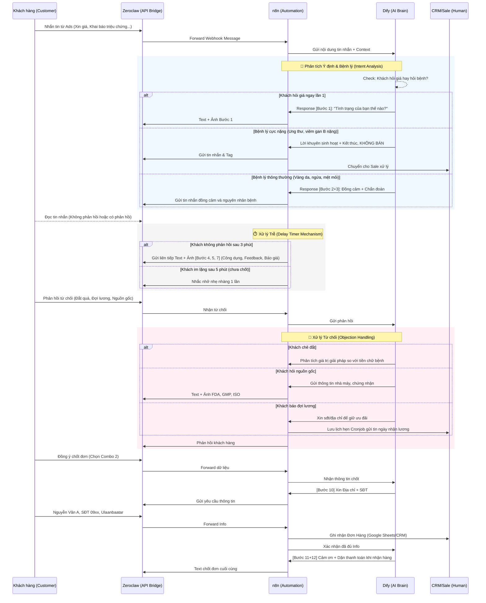

# 🤖 Dự án AI Sales Bot: Liver Detoxnic

Dự án này ứng dụng trí tuệ nhân tạo (AI) kết hợp tự động hóa để xây dựng một "Chuyên viên tư vấn sức khỏe & chốt sale" chuyên nghiệp, thay thế cho mô hình Chatbot kịch bản (Rule-based) truyền thống.

## 📁 Cấu trúc thư mục (Directory Structure)

Dưới đây là kiến trúc thư mục cho dự án kết hợp Dify + n8n + Zeroclaw:

```text
/liver_detoxnic_ai_sales_bot/
├── README.md               # Tài liệu tổng quan, Use cases và hướng dẫn dự án (File này)
│
├── dify/                   # Chứa thiết lập bộ não AI
│   ├── prompt.md           # Chứa System Prompt chi tiết của chuyên gia tư vấn (10 năm kinh nghiệm)
│   ├── knowledge_base/     # Thư mục chứa tài liệu Knowledge Base (RAG)
│   │   ├── product_faq.txt # Câu hỏi thường gặp về sản phẩm Liver Detoxnic
│   │   └── liver_health.md # Kiến thức y khoa cơ bản về bệnh gan để AI tra cứu
│   └── dsl_export.yaml     # File export cấu hình workflow/agent từ hệ thống Dify
│
├── n8n/                    # Chứa kịch bản tự động hóa và điều phối luồng
│   ├── workflows/          # Thư mục chứa các luồng n8n (.json)
│   │   ├── 01_main_sales_funnel.json       # Luồng tư vấn và chốt sale chính (Phễu 12 bước)
│   │   ├── 02_followup_reminder.json       # Luồng nhắc nhở (Delay 3 phút/5 phút)
│   │   └── 03_abandoned_cart_recovery.json # Luồng bám đuổi khách hàng (Hẹn lịch / Khách đợi lương)
│   └── assets/             # Chứa hình ảnh tĩnh gửi kèm theo kịch bản
│       ├── feedback/       # Ảnh feedback khách hàng sử dụng hiệu quả
│       ├── certificates/   # Giấy chứng nhận GMP, ISO, FDA...
│       └── products/       # Ảnh sản phẩm, combo khuyến mãi
│
└── zeroclaw/               # Chứa script kết nối & quản lý tài nguyên nền tảng
    └── scripts/
        ├── fb_messenger_bridge.js # Script kết nối API Messenger/Instagram
        └── anti_block_system.js   # Script điều phối luồng request tránh bị spam/block
```

---

## 📊 Sơ đồ Luồng Use Case (Use Case Flow Diagram)

Sơ đồ dưới đây mô tả luồng tương tác thực tế giữa **Khách hàng**, **Zeroclaw (Cổng kết nối)**, **n8n (Tự động hóa & Hẹn giờ)** và **Dify (Trí tuệ Nhân tạo AI)** theo quy trình 12 bước chăm sóc.



---

## 🎯 Phân tích Use Case Thực tế & Kịch bản Chăm sóc

Với kiến trúc **Dify (Trí tuệ) + n8n (Tự động hóa) + Zeroclaw (Giao tiếp bảo mật)**, hành trình khách hàng (Customer Journey) diễn ra hoàn toàn tự động nhưng lại mang cảm giác cá nhân hóa sâu sắc:

### 1. Phân loại & Chẩn đoán Y khoa (Inbound/Tư vấn)

- **Hành động của Khách hàng:** Nhắn tin từ Quảng cáo (VD: "Tôi hay bị ngứa da", "Lọ này bao nhiêu tiền?")
- **AI (Dify) xử lý:** Vượt ra ngoài ranh giới keyword thông thường. AI phân biệt được khách đang hỏi giá hay đang có triệu chứng. Thay vì nhảy ngay vào báo giá, AI đồng cảm, phân tích đúng bệnh lý ("Ngứa da là do gan không lọc được độc..."), chèn emoji thân thiện và đặt lợi ích sức khỏe lên hàng đầu.

### 2. Tư vấn sản phẩm & Gửi bằng chứng thuyết phục (Educate)

- **Hành động của AI:** Giới thiệu Liver Detoxnic như một giải pháp cứu cánh phù hợp y khoa.
- **n8n xử lý:** Cùng lúc AI tạo ra câu trả lời text, n8n gọi dữ liệu từ mục `/assets/feedback/` bắn kèm hình ảnh chứng minh lâm sàng, kích thích độ trust (tin tưởng) của khách hàng.

### 3. Vận hành quy trình Delay Timer & Bám đuổi (Follow-up)

- **Sức mạnh của n8n:** Botcake chỉ gửi tin theo rule đơn điệu. Ở đây, n8n đóng vai trò như một quản lý (Manager). Nếu sau tin nhắn báo giá mà **khách im lặng 3 phút**, n8n tự động trigger bước 4, 5, 7. Nếu **im lặng 5 phút** (sau báo giá), báo nhắc nhẹ. Mọi độ trễ được kiểm soát chính xác 100%.

### 4. Xử lý từ chối linh hoạt (Objection Handling)

- **Hành động của Khách hàng:** "Sản phẩm đắt quá", "Chưa tin nguồn gốc", "Tôi đợi cuối tháng lấy lương"...
- **AI & Tự động hóa xử lý:**
  - _Khách chê đắt:_ Dify sẽ hạ giọng đồng cảm, phân tích bài toán kinh tế giữa việc chữa bệnh gan và uống bảo vệ gan.
  - _Khách nghi ngờ:_ n8n lấy ảnh chứng nhận (FDA/GMP) từ `/assets/certificates/` gửi kèm lời khẳng định của Dify.
  - _Khách đợi lương:_ n8n gọi API bắn data về CRM/Google Sheets, thiết lập Cronjob (hẹn giờ) tự động gửi tin nhắn chốt lại ngay ngày khách báo nhận lương.

---

## 💼 Bài toán Thuyết phục Ban Giám Đốc (ROI & Business Value)

Phần này dùng để Pitching dự án với BGĐ, nhấn mạnh vào giá trị kinh tế:

### 🚀 Lợi ích Ngắn hạn (Có thể đo lường trong 1-3 tháng)

1.  **Cắt giảm 60-80% workload cho Telesale/Chatbot Operator:** Sale không phải bận rộn với các tin nhắn rác, hỏi dạo hay xin giá. Chỉ can thiệp vào các case cực khó hoặc chốt đại lý sỉ.
2.  **Tỷ lệ Chuyển đổi (CR) tăng vọt:** Xóa bỏ độ trễ của nhân sự người thật. Phản hồi trong 1 giây, hoạt động 24/7 (kể cả ban đêm). Không bỏ lỡ bất cứ lead nào từ Ads.
3.  **Tuân thủ quy trình 100% (Zero Error):** Khắc phục lỗi con người (sale quên ảnh feedback, báo sai giá, lên sai combo, quên xin địa chỉ). AI làm chính xác 100% lệnh.

### 🌟 Lợi ích Dài hạn (Lợi thế Canh tranh & Nâng tầm Doanh nghiệp)

1.  **Mở rộng quy mô vô hạn (Scalability):** Tăng ngân sách Ads x10 không cần phải tuyển thêm 20 sale. Hệ thống AI chỉ cần trả thêm tiền API là có thể gồng gánh lượng data khổng lồ.
2.  **Khả năng tự học và khai phá dữ liệu (Data Mining):** Đội ngũ Marketing có thể đọc Log của Dify để hiểu lý do sâu xa khách từ chối, từ đó điều chỉnh content quảng cáo.
3.  **Nhân bản tệp "Best-seller":** Dự án này không phải tạo ra một cái Chatbot, mà là tạo ra **1.000 chuyên gia tư vấn xuất sắc nhất** (cùng một tiêu chuẩn thấu cảm, giọng điệu), phục vụ thị trường Mông Cổ trơn tru mà không sợ rào cản ngôn ngữ hay văn hóa. Khoản đầu tư hạ tầng rẻ hơn rất nhiều so với quỹ lương nhân sự hàng tháng.
