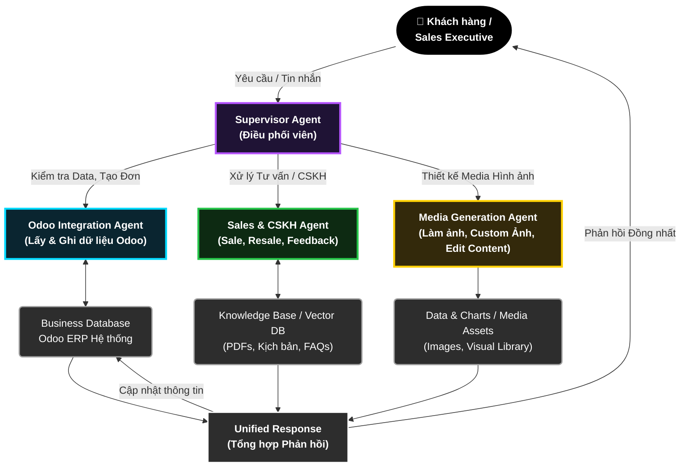

# 🤖 Dự án AI Sales Bot: Liver Detoxnic

Dự án này ứng dụng trí tuệ nhân tạo (AI) kết hợp tự động hóa để xây dựng một "Chuyên viên tư vấn sức khỏe & chốt sale" chuyên nghiệp, thay thế cho mô hình Chatbot kịch bản (Rule-based) truyền thống.

## 📁 Cấu trúc thư mục Đa Đặc vụ (Multi-Agent Directory Structure)

Dưới đây là kiến trúc thư mục cho dự án kết hợp Dify + n8n + Zeroclaw mở rộng tích hợp **Multi-Agent (Đa Đặc vụ)** và phần mềm kế toán **Odoo ERP**:

```text
/liver_detoxnic_ai_sales_bot/
├── README.md               # Tài liệu tổng quan, Use cases và hướng dẫn dự án (File này)
│
├── dify_agents/            # Hệ sinh thái Đa Đặc vụ phân tán
│   ├── supervisor.yaml     # Supervisor Agent (Nhận diện ngữ cảnh và luân chuyển task)
│   ├── odoo_agent/         # Đặc vụ Odoo (Hỏi đáp tồn kho, tạo lead, lưu trữ thông tin)
│   ├── sales_agent/        # Đặc vụ CSKH (Tư vấn, chốt sales, gửi nhắc nhở Resale)
│   ├── feedback_agent/     # Đặc vụ Chăm sóc hậu mãi (Lấy ý kiến, đo lường CSAT)
│   └── media_agent/        # Đặc vụ Visual (Render ảnh cá nhân hóa, edit báo giá)
│
├── n8n/                    # Chứa kịch bản tự động hóa và điều phối hệ thống
│   ├── workflows/          # Nơi cấu hình các Workflows .json
│   │   ├── 01_webhook_router.json          # Nhận in-bound request, trigger Supervisor
│   │   ├── 02_odoo_erp_sync.json           # Workflow lấy/ghi dữ liệu Odoo qua API
│   │   ├── 03_resale_feedback_loop.json    # Kịch bản sau 14 ngày/30 ngày xin feedback
│   │   └── 04_abandoned_cart.json          # Luồng Delay nhắc khách chốt đơn / đợi lương
│   └── assets/             # Chứa hình ảnh tĩnh và logic render động
│
└── zeroclaw/               # Chứa script kết nối & quản lý tài nguyên nền tảng
    └── scripts/
        ├── multi_channel_bridge.js # Script kết nối mạng xã hội
        └── anti_block_system.js    # Cân bằng tải, chống block khi auto-reply
```

---

## 📊 Kiến trúc Hệ thống Multi-Agent tích hợp Odoo

Lấy cảm hứng từ các kiến trúc AI hiện đại (tiêu biểu như mô hình điều phối nội bộ của Uber), dưới đây là sơ đồ **AI Multi-Agent** phối hợp xử lý cho Liver Detoxnic từ khâu tiếp cận, chẩn đoán, tích hợp phần mềm kế toán Odoo, đến tạo nội dung truyền thông.



---

## 🎯 Kịch bản Sử dụng (Use Cases) Chuyên Sâu của Multi-Agent

Việc nâng cấp thành một hệ thống **Multi-Agent** được phân quyền rõ ràng giải quyết triệt để sự "cứng nhắc" của một chatbot đơn lẻ, mang lại giá trị vận hành 360 độ:

### 1. Đồng bộ Quản trị Dữ liệu qua Odoo (Enterprise Data Management)

- **Hành động:** Khi khách hàng hỏi _"Sản phẩm có sẵn không?"_ hoặc đồng ý mua hàng.
- **AI xử lý (Odoo Agent):** Supervisor phân tích câu hỏi, gọi luồng Odoo Agent. Đặc vụ này truy vấn trực tiếp vào Odoo ERP lấy số lượng tồn kho theo thời gian thực. Khi chốt sale thành công (xin đủ SĐT/Địa chỉ), nó tự động đẩy dữ liệu tạo 1 **Sale Order** và **Khách hàng** mới vào Odoo. Không tốn một phép tính thủ công từ nhân sự thật.

### 2. Hành trình Chốt Sales (Sales CSKH)

- **Hành động:** Khách hàng chia sẻ tình trạng bệnh lý gan mật (vàng da, nổi mẩn, dị ứng).
- **AI xử lý (Sales Agent):** Truy cập Vector DB chứa Kiến thức Y khoa để đưa ra chẩn đoán chính xác nhất. Đặc vụ đồng cảm, xử lý các tình huống từ chối phức tạp, đồng thời kích hoạt các phễu **Delay Follow-up** bằng n8n (Nhắc nhở sau 3 phút im lặng, nhắc hẹn ngày nhận lương).

### 3. Vòng lặp Resale & Xin Feedback tự động (Post-purchase Loop)

- **Hành động:** Hệ thống Odoo báo đơn hàng đã "Hoàn thành" được 14 ngày hoặc 30 ngày.
- **AI xử lý (Sales / Feedback Agent):** AI chạy ngầm lệnh hỏi thăm: _"Anh/chị sử dụng sản phẩm 14 ngày qua thấy tình trạng nóng trong người có giảm không?"_. Tùy theo câu trả lời (CSAT), AI sẽ tự động ghi chuỗi Feedback đó vào Odoo. Nếu tính toán dữ liệu báo lộ trình đã hết hộp đầu tiên -> Tự động trigger luồng Resale (Khuyên mua tiếp để duy trì hiệu quả lâu dài).

### 4. Hỗ trợ Edit & Tạo Visual Tự động (Media Generation - Khả năng tương lai)

- **Hành động:** Cần gửi bảng giá đồ họa đẹp mắt, hình ảnh Feedback xác thực bằng watermark, hoặc custom ảnh lời chúc sinh nhật theo tên khách được trích từ Odoo.
- **AI xử lý (Media Agent):** Đặc vụ Media sử dụng thư viện ảnh sẵn có và công nghệ Image Generation Models để thiết kế và xuất ra những hình minh họa sát nhất với yêu cầu. Điều này giúp cá nhân hóa cực mạnh trong Marketing bằng hình ảnh.

---

## 💼 Tổng kết Giá trị Đầu tư (ROI) Dành cho Ban Giám Đốc

Triển khai cấu trúc Đa Đặc vụ (Multi-Agent) không chỉ để chat cho "giống người", mà là kiến tạo một phòng kinh doanh siêu tốc độ với mức chi phí cố định:

1. **Phá vỡ giới hạn dữ liệu (Zero Data Silos):** Hệ thống Data Chat hòa quyện 2 chiều làm một với Odoo. Kế toán/Kho vận nắm bắt tình hình kinh doanh real-time không trễ nhịp.
2. **Kích hoạt Vòng đời Khách hàng Vĩnh cửu (High LTV):** Hệ thống không chỉ chăm chăm "chốt món hàng cúp máy" mà còn nuôi dưỡng, khai thác lại Database trên Odoo bằng các luồng Resale Tự động chính xác tới từng giây.
3. **Architecture Mở rộng dễ dàng theo mô-đun:** Sơ đồ Supervisor chia nhánh Đặc Vụ hỗ trợ CTO tự do "bọc thêm" các Đặc vụ mới vào công ty trong tương lai (Ví dụ: Đặc vụ dịch đa ngôn ngữ, Đặc vụ Kế toán đòi nợ, Đặc vụ Visual làm video...) mà không làm đứt gãy quy trình cốt lõi đang kiếm tiền.
