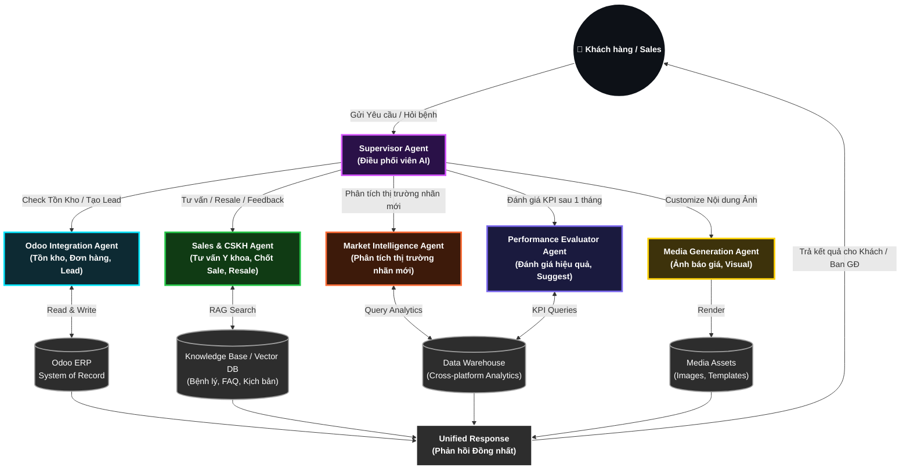

# 🤖 Liver Detoxnic — AI Sales Bot: Chiến lược AI Doanh nghiệp

## 1) Mục tiêu Dự án (Executive Objective)

- **Mục tiêu chủ đạo:** Xây dựng hệ thống AI đa đặc vụ (Multi-Agent) thay thế mô hình Chatbot kịch bản (Rule-based) truyền thống, giải quyết **3 bài toán lõi** của doanh nghiệp:
  1. **AI dùng để làm gì?** — Minh chứng ROI cụ thể qua use case Chăm sóc Khách hàng & chốt sales.
  2. **Nhãn mới cần AI phân tích trước khi ra mắt** — Đánh giá thị trường, phân khúc khách hàng, định vị sản phẩm bằng AI trước khi đổ tiền marketing.
  3. **Đánh giá hiệu quả sau triển khai** — Sau 1 tháng chạy nhãn mới, AI đo lường KPI thực tế và đề xuất hành động tiếp theo (suggest nên làm gì).
- **Top 2 Use Cases ưu tiên:**
  1. AI Customer Care & Sales Agent (Chăm sóc & chốt sales tự động 24/7)
  2. AI Market Intelligence & Performance Evaluator (Phân tích thị trường nhãn mới + đánh giá hiệu quả)
- **Tác động kỳ vọng:** Giảm 60% thời gian chăm sóc khách hàng, tăng 2-3x tỷ lệ chốt đơn, rút ngắn chu kỳ ra quyết định nhãn mới từ 2 tháng xuống 2 tuần.

---

## 2) Bối cảnh Doanh nghiệp (Business Context)

| Yếu tố                | Chi tiết                                                                                   |
| :-------------------- | :----------------------------------------------------------------------------------------- |
| **Sản phẩm**          | Liver Detoxnic — Thực phẩm chức năng hỗ trợ gan, bán lẻ online B2C                         |
| **Kênh phân phối**    | Facebook Messenger, Zalo, TikTok Shop, Shopee, Lazada                                      |
| **Hệ thống lõi**      | Odoo ERP (Bán hàng, Kho, Kế toán), Botcake/Pancake (Chat automation)                       |
| **Nguồn lực AI**      | 2 AI Engineers, 2 Data Engineers, 2 Core Dev, 1 Infra, 4 BA                                |
| **Quy mô dữ liệu**    | 300,000+ khách hàng, 50+ kịch bản bệnh lý, 1000+ câu hỏi FAQ                               |
| **Biến động sắp tới** | Công ty có thể ra thêm nhãn mới bất kỳ lúc nào → cần framework đánh giá thị trường bằng AI |

---

## 3) Vấn đề Cốt lõi (Core Challenges)

### 3.1 Bài toán 1: "AI dùng để làm gì?" — Chứng minh giá trị thực

| Vấn đề                                                                          |   Mức độ    | Hệ quả hiện tại                                                                           |
| :------------------------------------------------------------------------------ | :---------: | :---------------------------------------------------------------------------------------- |
| Sales team trả lời lặp đi lặp lại 80% câu hỏi giống nhau (giá, ship, công dụng) | 🔴 Critical | Lãng phí 4-6 giờ/ngày/nhân sự cho FAQ, không tập trung vào khách tiềm năng                |
| Chatbot cũ theo kịch bản cứng nhắc, không hiểu ngữ cảnh bệnh lý                 | 🔴 Critical | Khách hỏi "gan nóng, mặt nổi mụn" → Bot trả lời "Vui lòng chọn menu bên dưới" → Mất khách |
| Không follow-up được sau bán hàng (resale loop)                                 |   🟡 High   | Lifetime Value thấp, mua 1 lần rồi quên                                                   |
| **Meta xóa Message Tag (từ 10/02/2026)** → Chỉ cho gửi tin ngoài 24h qua opt-in | 🔴 Critical | Human không thể scale việc lọc/gửi mẫu _Marketing/Utility Message_ → Dễ bị Meta khóa Page |
| Ban giám đốc hỏi "AI làm được gì cho mình?" → Chưa có câu trả lời cụ thể        | 🔴 Critical | Chậm phê duyệt ngân sách AI, mất cơ hội thị trường                                        |

### 3.2 Bài toán 2: Ra nhãn mới — Cần AI phân tích trước khi đổ tiền

| Vấn đề                                                               |   Mức độ    | Hệ quả hiện tại                                                    |
| :------------------------------------------------------------------- | :---------: | :----------------------------------------------------------------- |
| Quyết định ra nhãn mới dựa trên cảm tính, không có data-driven       | 🔴 Critical | Rủi ro thất bại cao, đốt tiền marketing cho sản phẩm không phù hợp |
| Không biết đối thủ cạnh tranh đang làm gì trên cùng phân khúc        |   🟡 High   | Định vị sai, pricing sai, messaging sai                            |
| Không có benchmark để đánh giá tiềm năng thị trường trước khi launch |   🟡 High   | Không dự đoán được quy mô thị trường addressable                   |

### 3.3 Bài toán 3: Đánh giá hiệu quả sau 1 tháng — "Nên làm gì tiếp?"

| Vấn đề                                                              |   Mức độ    | Hệ quả hiện tại                                                            |
| :------------------------------------------------------------------ | :---------: | :------------------------------------------------------------------------- |
| Sau khi launch nhãn mới 1 tháng, không có hệ thống đo lường tự động | 🔴 Critical | Dữ liệu rải rác trên Odoo, FB Ads, Shopee → Mất 1-2 tuần mới tổng hợp xong |
| Không có AI suggest "nên scale up hay cut loss"                     |   🟡 High   | Quyết định chậm → đốt thêm tiền cho campaign kém hiệu quả                  |
| Feedback khách hàng sau mua không được thu thập có hệ thống         |   🟡 High   | Không biết sản phẩm có hiệu quả thực sự không, không có social proof       |

---

## 4) Kiến trúc Mục tiêu (Target Architecture — Hub-and-Spoke)

### 4.1 Các Lớp Logic (Logical Layers)

| Lớp                        | Thành phần                                         | Vai trò                                                |
| :------------------------- | :------------------------------------------------- | :----------------------------------------------------- |
| **Interaction Layer**      | Messenger, Zalo, TikTok, Shopee Chat, OpenWebUI    | Điểm tiếp xúc khách hàng & nhân viên                   |
| **AI Orchestration Layer** | Dify.AI (RAG + Workflow) + Supervisor Agent        | Bộ não: hiểu ngữ cảnh, phân luồng task, suy luận       |
| **Execution Layer**        | n8n (Automation) + ZeroClaw (Sandbox Runtime)      | Tay chân: thực thi hành động qua API hẹp, có audit log |
| **Data Foundation**        | Odoo ERP → Data Lake → Data Warehouse → Data Marts | Nền tảng dữ liệu: làm phẳng trước khi AI đọc           |

### 4.2 Sơ đồ Kiến trúc Multi-Agent



### 4.3 Quyết định Kiến trúc (Architectural Decisions)

| Câu hỏi                                         | Quyết định                                  | Lý do                                                  | Rủi ro nếu không làm                    |
| :---------------------------------------------- | :------------------------------------------ | :----------------------------------------------------- | :-------------------------------------- |
| Tại sao không kết nối AI thẳng vào Odoo?        | AI chỉ đọc Data Marts đã flatten            | LLM không hiểu 1000+ bảng quan hệ Odoo → hallucination | Báo cáo sai, AI "ảo giác" join sai bảng |
| Tại sao tách Bộ não (Dify) khỏi Thực thi (n8n)? | Dify Read-only, n8n thực thi qua API hẹp    | Lỗi AI hallucination có thể xóa dữ liệu thật           | Data corruption, mất đơn hàng           |
| **ZeroClaw dùng để làm gì trong kiến trúc?**    | Là "Phòng cách ly" (Sandbox) chứa AI        | Ngăn chặn AI vượt quyền truy cập Hệ điều hành/DB lõi   | Hacker inject prompt chiếm quyền server |
| Tại sao cần PII Scrubber?                       | Presidio ẩn danh trước khi gọi LLM          | Khách chat số thẻ, CMND trên Messenger                 | Rò rỉ thông tin cá nhân ra bên thứ 3    |
| Tại sao cần Semantic Cache?                     | Redis/Qdrant cache 80% câu hỏi lặp          | "Giá bao nhiêu", "Ship bao lâu" lặp lại liên tục       | Đốt 40% chi phí token không cần thiết   |
| Tại sao cần RBAC?                               | Phân quyền theo vai trò (Sales/Manager/CEO) | Nhân viên cấp dưới xem được dữ liệu ban giám đốc       | Context Bleed, data leak nghiêm trọng   |

---

## 5) Use Case A: AI Customer Care & Sales Agent

> **Trả lời bài toán:** "AI dùng để làm gì?" → Đây là minh chứng ROI trực tiếp, thay thế được nhân sự lặp lại.

### 5.1 Vấn đề Hiện tại (Pain Points)

| Pain Point                                                        |   Mức độ    | Chi phí hiện tại                              |
| :---------------------------------------------------------------- | :---------: | :-------------------------------------------- |
| 80% câu hỏi FAQ lặp lại, sales đáp thủ công                       | 🔴 Critical | 4-6 giờ/ngày/nhân sự lãng phí                 |
| Chatbot kịch bản không hiểu "gan nóng, mẩn đỏ" → trả lời trật lất | 🔴 Critical | Mất 30-40% khách tiềm năng do bot trả lời sai |
| Không follow-up resale sau 14-30 ngày                             |   🟡 High   | LTV thấp, chỉ bán 1 lần rồi mất khách         |
| Không đo lường CSAT (Customer Satisfaction Score)                 |   🟡 High   | Không biết khách hàng hài lòng hay không      |

### 5.2 Giải pháp: Hệ thống Multi-Agent

| Module                                | Input                                                   | Output                                                                                  | SLA             | Impact                    |
| :------------------------------------ | :------------------------------------------------------ | :-------------------------------------------------------------------------------------- | :-------------- | :------------------------ |
| **Sales Agent** (Tư vấn & Chốt sale)  | Khách hỏi tình trạng bệnh lý (vàng da, nóng trong, mụn) | Chẩn đoán dựa trên Vector DB Y khoa → Tư vấn sản phẩm → Thu thập SĐT/Địa chỉ → Chốt đơn | <10s phản hồi   | Thay thế 80% FAQ thủ công |
| **Odoo Agent** (Đồng bộ đơn hàng)     | Khách đồng ý mua → AI thu thập thông tin                | Tự động tạo Sale Order + Khách hàng mới trên Odoo ERP                                   | Real-time       | Zero nhập liệu thủ công   |
| **Feedback Agent** (Hậu mãi & Resale) | Odoo báo đơn hàng "Hoàn thành" 14/30 ngày               | Hỏi thăm tình trạng sức khỏe → Thu CSAT → Trigger Resale nếu hết lộ trình               | Auto-trigger    | Tăng LTV 2-3x             |
| **Delay Follow-up** (n8n Workflow)    | Khách im lặng >3 phút hoặc nói "đợi lương"              | n8n delay → Nhắc nhở với offer phù hợp                                                  | Configurable    | Giảm 50% abandoned cart   |
| **Meta Compliance Engine**            | Meta xóa Message Tag, khách quá 24h tương tác           | AI tự động map sang khuôn mẫu _Marketing Message_ hoặc _Utility Message_ hợp lệ         | 100% chuẩn Meta | Fanpage luôn an toàn      |

### 5.3 Kịch bản Chi tiết

#### Kịch bản 1: Khách hỏi bệnh → Chốt sales

```
Khách: "Gần đây hay bị nóng trong, nổi mẩn đỏ, ăn không ngon"
→ Supervisor nhận diện → Phân luồng Sales Agent
→ Sales Agent truy vấn Vector DB → Nhận diện: triệu chứng gan nóng
→ AI đồng cảm + tư vấn liệu trình Liver Detoxnic
→ Khách đồng ý → AI thu SĐT, địa chỉ
→ Supervisor kích hoạt Odoo Agent → Tạo Sale Order trên Odoo
→ Xong: Khách nhận xác nhận đơn hàng
```

#### Kịch bản 2: Resale tự động sau 14 ngày (Tuân thủ luật Meta Messaging)

```
(Luật mới của Meta: Đã vượt 24h, không thể reply tự do)
Odoo báo: Đơn hàng #12345 "Hoàn thành" 14 ngày
→ n8n kiểm tra rule: Khách đã Opt-in nhận Marketing Message
→ AI tự động format nội dung vào template *Marketing Message* đã duyệt:
  "Chào {{Tên}}, liệu trình {{Sản phẩm}} tuần đầu tiên của anh/chị..."
→ Gửi đi hợp lệ 100%. Khách trả lời tích cực → (Mở lại cửa sổ 24h miễn phí)
→ Khách rep lại → Sales Agent bay vào chăm sóc & Trigger luồng Resale tự nhiên:
  "Để duy trì hiệu quả lâu dài, em hướng dẫn anh/chị liệu trình dùng tiếp..."
```

### 5.4 KPI Targets

| KPI                                |  Baseline | Target (3 tháng) | Target (6 tháng) |
| :--------------------------------- | --------: | ---------------: | ---------------: |
| Thời gian phản hồi FAQ             | 5-30 phút |  <10 giây (-99%) |          <5 giây |
| Tỷ lệ chốt đơn (Conversion Rate)   |      5-8% |      12% (+100%) |      18% (+200%) |
| Số cuộc hội thoại/ngày mà AI xử lý |         0 |             200+ |             500+ |
| Customer Satisfaction (CSAT)       |  Không đo |              75% |              85% |
| Resale Rate (khách mua lại)        |       10% |      25% (+150%) |      35% (+250%) |
| Thời gian nhân sự tiết kiệm/ngày   |         0 |            4 giờ |            6 giờ |

---

## 6) Use Case B: AI Market Intelligence & Performance Evaluator

> **Trả lời bài toán:** "Công ty có nhãn mới → AI phân tích trước" + "Chạy được 1 tháng → đánh giá hiệu quả, suggest nên làm gì"

### 6.1 Vấn đề Hiện tại (Pain Points)

| Pain Point                                                  |   Mức độ    | Chi phí hiện tại                                           |
| :---------------------------------------------------------- | :---------: | :--------------------------------------------------------- |
| Quyết định ra nhãn mới dựa trên cảm tính, không data-driven | 🔴 Critical | Rủi ro thất bại cao, đốt 50-100 triệu VNĐ cho campaign sai |
| Không biết đối thủ làm gì trên cùng phân khúc               |   🟡 High   | Định vị sai, pricing sai, messaging sai                    |
| Sau 1 tháng launch: không có dashboard đánh giá tự động     | 🔴 Critical | Mất 1-2 tuần tổng hợp data rải rác từ Odoo + FB + Shopee   |
| Không có AI suggest "nên scale hay cut loss"                |   🟡 High   | Tiếp tục đốt tiền cho campaign kém hiệu quả                |

### 6.2 Giải pháp: 2 Module AI

#### Module A: Market Intelligence Agent (Trước khi ra nhãn mới)

| Chức năng                | Input                                     | Output                                                                       | SLA                 | Impact                       |
| :----------------------- | :---------------------------------------- | :--------------------------------------------------------------------------- | :------------------ | :--------------------------- |
| **Phân tích thị trường** | "Muốn ra nhãn collagen cho thị trường VN" | Báo cáo: Quy mô TM, tăng trưởng, top đối thủ, giá trung bình, kênh phân phối | 1 ngày (vs 2 tháng) | Ra quyết định nhanh 60x      |
| **Phân tích đối thủ**    | Danh sách đối thủ + category              | So sánh pricing, USP, reviews, ad spend ước tính                             | 2 giờ               | Định vị chính xác            |
| **Đề xuất định vị**      | Dữ liệu thị trường + profile công ty      | Đề xuất phân khúc giá, messaging, kênh ưu tiên, budget dự kiến               | 30 phút             | Giảm rủi ro launch sai hướng |
| **Dự đoán tiềm năng**    | Historical data + market data             | Dự báo doanh số tiềm năng (3/6/12 tháng), confidence interval                | 1 giờ               | Quyết định có/không launch   |

**Ví dụ thực tế:**

```
Ban GĐ: "Công ty muốn ra nhãn mới — Collagen dưỡng da. AI đánh giá giúp."

→ Market Intelligence Agent hoạt động:
  1. Crawl & RAG Search: thị trường collagen VN, quy mô, trends
  2. Phân tích 20 đối thủ top (DHC, Shiseido, Laneige...)
  3. So sánh: pricing ($5-50), USP, reviews (4.2-4.8⭐), kênh phân phối
  4. Output: Báo cáo chi tiết:
     - Quy mô thị trường: ~2,000 tỷ VND, tăng trưởng 15%/năm
     - Cơ hội: phân khúc $10-20 còn ít cạnh tranh
     - Rủi ro: phải có chứng nhận ATTP, cạnh tranh quảng cáo cao
     - Đề xuất: Launch với giá 299K, focus Shopee + TikTok, budget tối thiểu 50tr/tháng
     - Confidence: 72% — cần thêm data survey khách hàng thật
```

#### Module B: Performance Evaluator Agent (Sau 1 tháng chạy nhãn mới)

| Chức năng                | Input                                     | Output                                                                       | SLA           | Impact                          |
| :----------------------- | :---------------------------------------- | :--------------------------------------------------------------------------- | :------------ | :------------------------------ |
| **Dashboard tự động**    | Odoo + FB Ads + Shopee Analytics          | KPI tổng hợp: Doanh số, ROAS, CAC, Conversion Rate, Reviews                  | Real-time     | Bỏ 1-2 tuần tổng hợp thủ công   |
| **So sánh vs Kỳ vọng**   | Target ban đầu vs Actual data             | Gap analysis: "Doanh số đạt 65% target, ROAS thấp hơn 30%"                   | Auto-generate | Biết ngay chỗ nào cần sửa       |
| **Root Cause Analysis**  | Data anomalies                            | "ROAS thấp do: 60% traffic từ TikTok nhưng conversion chỉ 1.2% (vs FB 4.5%)" | 5 phút        | Hiểu nguyên nhân thay vì đoán   |
| **AI Suggest hành động** | Dashboard + Gap analysis + Market context | Đề xuất cụ thể với priority: Scale / Pivot / Cut Loss                        | Tức thì       | Quyết định nhanh, giảm lãng phí |

**Ví dụ thực tế:**

```
Sau 1 tháng chạy nhãn Collagen:

→ Performance Evaluator Agent tự động generate báo cáo:

📊 KPI THÁNG 1 — COLLAGEN DƯỠNG DA
├─ Doanh số: 85 triệu VNĐ (Target: 120 triệu → Đạt 71%)
├─ ROAS: 2.1x (Target: 3x → Dưới target 30%)
├─ Đơn hàng: 312 đơn (Target: 400 → Đạt 78%)
├─ CAC: 95K/khách (Target: 70K → Vượt 36%)
├─ Reviews: 4.3⭐ (38 reviews, 89% positive)
└─ Resale Rate: 8% (quá sớm để đánh giá)

🔍 ROOT CAUSE ANALYSIS:
├─ TikTok chiếm 55% budget nhưng conversion chỉ 1.2% (vs FB 4.5%)
├─ Creative #3 và #7 chiếm 70% impressions nhưng CTR thấp nhất
└─ Phân khúc 25-34 tuổi convert tốt nhất, đang under-invest

💡 AI SUGGEST — ĐỀ XUẤT HÀNH ĐỘNG (Priority cao → thấp):
1. 🔴 PIVOT budget: Chuyển 30% budget từ TikTok → FB Ads (expected ROAS +40%)
2. 🟡 CẮT creative #3, #7 — thay bằng A/B test 3 creative mới
3. 🟢 SCALE phân khúc 25-34 tuổi: tăng 20% budget cho segment này
4. 🟢 THU THẬP thêm reviews: trigger AI feedback agent cho 312 khách

📈 DỰ BÁO THÁNG 2 (nếu áp dụng suggest):
├─ Doanh số dự kiến: 130-150 triệu VNĐ (+53-76%)
├─ ROAS dự kiến: 2.8-3.2x
└─ Confidence: 68% — cần validate bằng 1 tuần A/B test
```

### 6.3 KPI Targets

| KPI                                            |  Baseline | Target (3 tháng) |  Target (6 tháng) |
| :--------------------------------------------- | --------: | ---------------: | ----------------: |
| Thời gian phân tích thị trường nhãn mới        | 1-2 tháng |  1-2 ngày (-95%) |      4 giờ (-99%) |
| Thời gian có báo cáo hiệu quả sau launch       |  1-2 tuần |    1 ngày (-86%) |         Real-time |
| Accuracy của market forecast                   |  Không có |              65% |               80% |
| % quyết định có data-driven suggest            |       10% |              70% |               90% |
| Tiền lãng phí tránh được cho nhãn kém hiệu quả |         0 | 50 triệu VNĐ/quý | 150 triệu VNĐ/quý |

---

## 7) Ma trận Rủi ro & Cơ chế Xử lý (Risk Matrix)

| Rủi ro                                                |   Mức độ    | Component                     | Cơ chế xử lý                                                              | Owner             |
| :---------------------------------------------------- | :---------: | :---------------------------- | :------------------------------------------------------------------------ | :---------------- |
| AI tư vấn sai bệnh lý → Khách phản ứng phụ            | 🔴 Critical | Sales Agent + Vector DB       | Confidence <80% → "Em khuyên anh/chị nên hỏi ý kiến bác sĩ", Log + Review | AI Tech Lead      |
| AI recommend sai khi đánh giá nhãn mới                | 🔴 Critical | Market Intelligence Agent     | Bắt buộc source citation, confidence score, Human Review mandatory        | BA Lead           |
| Suggest "scale" nhưng thực tế nên "cut loss"          |   🟡 High   | Performance Evaluator         | Threshold: chỉ suggest scale nếu ROAS >2x và >100 data points             | Data Steward      |
| Chi phí LLM API tăng cao khi nhiều hội thoại          |   🟡 High   | Semantic Cache + Rate Limiter | Cache 80% FAQ, Circuit Breaker khi quota sắp hết                          | Infra Lead        |
| Data leak — khách hàng PII rò rỉ                      | 🔴 Critical | PII Scrubber (Presidio)       | Ẩn danh trước khi gọi LLM, Zero PII ra ngoài                              | Security Champion |
| Khách phàn nàn "nói chuyện với bot, không phải người" |   🟡 High   | Sales Agent                   | Escalation rule: 3 lần frustration → Chuyển nhân viên thật                | AI Product Owner  |

---

## 8) Chi phí & ROI Model

### 8.1 Chi phí Triển khai

| Hạng mục                     | Một lần (CAPEX) |  Hàng tháng (OPEX) | Ghi chú                    |
| :--------------------------- | --------------: | -----------------: | :------------------------- |
| Dify Self-hosted (VPS 16GB)  |            $500 |           $150-300 | RAG + Workflow engine      |
| LLM API (GPT-4o)             |               — |           $200-400 | Tư vấn bệnh lý + phân tích |
| ZeroClaw Runtime             |            $300 |                $50 | Sandbox isolation          |
| Redis/Qdrant Semantic Cache  |            $200 |                $50 | Cache FAQ responses        |
| n8n Automation               |               — |                 $0 | Self-hosted                |
| Nhân sự nội bộ (14 tuần dev) |              $0 |                 $0 | Internal team              |
| **TỔNG**                     |     **~$1,000** | **$450-800/tháng** |                            |

### 8.2 ROI Dự kiến

| Use Case                     |     Chi phí/năm | Giá trị mang lại                                                                   |      ROI | Confidence           |
| :--------------------------- | --------------: | :--------------------------------------------------------------------------------- | -------: | :------------------- |
| **AI Customer Care & Sales** |          $6,600 | Giảm 2 FTE chi phí nhân sự ($12K), tăng 2x conversion ($50K+), Resale loop ($30K+) |  **14x** | 🟢 High (đã có data) |
| **AI Market Intelligence**   |          $3,600 | Tránh 2 nhãn thất bại/năm ($100K+), ra quyết định nhanh 60x                        |  **28x** | 🟡 Medium (ước tính) |
| **AI Performance Evaluator** |          $2,400 | Tiết kiệm 80 giờ/năm phân tích ($5K), pivot sớm tránh lãng phí ($50K+)             |  **23x** | 🟡 Medium (ước tính) |
| **TỔNG**                     | **$12,600/năm** | **~$247K+**                                                                        | **~20x** |                      |

### 8.3 Tầm nhìn Nâng cao (Tại sao Dòng tiền đầu tư này XỨNG ĐÁNG?)

Khoản đầu tư $12,600 không chỉ mua một "con Chatbot", mà là thiết lập **Hạ tầng Bộ não Tư duy (Orchestrator Hub)**. Khi có hạ tầng này (Dify + ZeroClaw + DWH), tích hợp thêm các "Chân tay" (Agent) khác ở các quý sau sẽ tốn **rất ít chi phí biên nhưng mang lại giá trị cấp số nhân**:

1. **AI Content & Ads Automation (Phá vỡ nút thắt Thủ công):**
   - **Hiện tại:** Nhân sự viết Content → Đưa AI check tiêu chí policy công ty → Duyệt xong nhân sự lại phải ra Facebook tự set campaign, tạo Ads thủ công khó nhọc.
   - **Quý sau:** AI liên tục scan các chiến dịch đang "win" (hiệu quả) của công ty và **CẢ ĐỐI THỦ** → Tự động sinh ra các mẫu Content bám theo mẫu win đó → **Tự động push tạo Campaign và Ads Set trực tiếp qua FB API**. Nhân sự lúc này chỉ đóng vai trò Review và Approve ngân sách, giảm lãng phí thời gian và tăng độ nhạy bén chiến dịch.

2. **AI Media Agent (Edit Video & Tạo Ảnh Tự động):**
   - Tương lai không chỉ dừng ở text. AI kết nối các bộ công cụ hình ảnh/video để tự động cắt ghép, gen ra hàng loạt mẫu video reels/TikTok với kịch bản được tối ưu sẵn cho nhãn mới. Chi phí thuê ngoài đội ngũ Production sẽ giảm >60%.

3. **AI DevOps & System Protection (Gác Đền Hệ Thống):**
   - Khả năng sống còn của chiến dịch Ads là hệ thống vận hành trơn tru. Hệ thống tự động đẩy Agent bắt tay với Github/Sentry. Thay vì Odoo lỗi, n8n webhook sập lúc 2h sáng không ai biết, AI sẽ bắn Alert khẩn cấp cấp độ 1 kèm **Chẩn đoán Nguyên nhân lõi (Root Cause)**: _"Bug nghiêm trọng dòng 45 multi_channel_bridge.js do Meta đổi version. Suggest Fix: ..."_. DevOps vào chỉ việc dán lại code.

---

## 9) Lộ trình Triển khai 6 Tháng (Implementation Roadmap)

| Phase                      | Timeline   | Focus                                                   | Deliverables                                                                     | Exit Criteria                                   |
| :------------------------- | :--------- | :------------------------------------------------------ | :------------------------------------------------------------------------------- | :---------------------------------------------- |
| **0 — Nền tảng**           | Tháng 1-2  | Data Marts + Infra AI                                   | Deploy Dify + ZeroClaw + n8n, tạo `v_ai_sales`, `v_ai_market`, RBAC ready        | AI trả lời đúng 80% "Golden Queries"            |
| **1 — Pilot Sales Bot**    | Tháng 3-4  | Use Case A: AI Customer Care                            | Sales Agent live trên Messenger, Odoo Agent tạo đơn tự động, Feedback Agent chạy | 200+ hội thoại/ngày, Conversion ≥10%            |
| **2 — Pilot Market Intel** | Tháng 5-6  | Use Case B: Market Intelligence + Performance Evaluator | Agent phân tích nhãn mới, Dashboard tự động KPI 1 tháng, AI Suggest              | Báo cáo thị trường <1 ngày, Dashboard real-time |
| **3 — Scale & Optimize**   | Tháng 7-12 | Tối ưu toàn hệ thống                                    | Budget optimization ML, Scale channels, A/B test AI vs Manual                    | ROI ≥15x, 90% user adoption                     |

---

## 10) Quản trị & Giới Hạn Cứng (Governance)

### 10.1 Nguyên tắc Ngắt mạch (Hard Circuit-Breaker)

- ✅ **Audit Trail** — Log 100% AI interactions: ai hỏi gì, AI trả lời gì, khi nào
- ✅ **Data Freshness Tagging** — Mọi response gắn `last_synced_time`, warning nếu data >1 giờ
- ✅ **Sandbox Isolation** — ZeroClaw cô lập runtime, không root privilege
- ✅ **RBAC Strict** — Sales chỉ xem data đơn hàng, Manager xem KPI, CEO toàn quyền

### 10.2 Điều kiện Dừng (Stop Conditions)

| Điều kiện           |                Ngưỡng                | Hành động                                  |
| :------------------ | :----------------------------------: | :----------------------------------------- |
| User Adoption       | <50% weekly active users sau 3 tháng | Interview users, fix UX, retrain           |
| Accuracy            |      <75% câu trả lời chính xác      | Review RAG data quality, tune prompts      |
| Security            |         Bất kỳ PII leak nào          | **STOP NGAY** → Audit → Patch → Retest     |
| AI Suggest Accuracy |       <60% suggest đúng hướng        | Review evaluation model, thêm human review |

### 10.3 Chu kỳ Review (Operating Cadence)

| Chu kỳ         | Hoạt động                                    | Participants             |
| :------------- | :------------------------------------------- | :----------------------- |
| **Hàng tuần**  | Sprint review: demo tiến độ, fix bugs        | AI Team + BA             |
| **Hàng tháng** | KPI review: adoption, accuracy, ROI tracking | All Stakeholders         |
| **Hàng quý**   | ROI assessment: Go/No-Go cho phase tiếp theo | C-Level + Business Heads |

---

## 11) Khuyến nghị & 30 Ngày Đầu Tiên

### Go/No-Go Decision

**✅ Khuyến nghị: GO** — Với tổng chi phí ~$12,600/năm và ROI dự kiến ~20x, dự án có tỷ suất hoàn vốn cực cao. Rủi ro được kiểm soát bởi kiến trúc Hub-and-Spoke với RBAC, PII Scrubber, và Audit Trail.

### 30 Ngày Đầu Tiên

| Tuần | Hành động                                                        | Owner           | Output                         |
| :--- | :--------------------------------------------------------------- | :-------------- | :----------------------------- |
| 1    | Tạo Data Marts `v_ai_sales`, `v_ai_product` từ Odoo              | Data Team       | SQL Views ready                |
| 2    | Deploy Dify + ZeroClaw trên Dev server                           | AI Team         | Infra running                  |
| 2    | Import 1000+ FAQ + 50 kịch bản bệnh lý vào Vector DB             | BA + AI Team    | Knowledge Base ready           |
| 3    | Build Sales Agent MVP: tư vấn + chốt sales trên Messenger        | AI Team         | Demo-able prototype            |
| 4    | Internal testing: 5 Sales nhân viên thật test 100 cuộc hội thoại | Sales Team + BA | Accuracy report, feedback list |

### Key Dependencies

- Odoo API access (read + write Sale Orders)
- Facebook Messenger API qua Botcake/Pancake
- Vector DB chứa kiến thức Y khoa đã được kiểm duyệt bởi chuyên gia
- Budget GPU/VPS cho Dify self-hosted

### Rủi ro Cần Ban GĐ Phê duyệt

1. **Kiến thức Y khoa trong Vector DB** — Phải được chuyên gia y tế kiểm duyệt trước khi AI sử dụng để tư vấn
2. **AI tạo đơn hàng trên Odoo** — Cần xác nhận quy trình: AI tạo draft → Nhân viên approve, hay AI tạo trực tiếp?
3. **Policy khi AI suggest "Cut Loss" cho nhãn mới** — Ban GĐ có chấp nhận AI recommend dừng sản phẩm không?

---

## 📁 Cấu trúc Thư mục Dự án

```text
/liver_detoxnic_ai_sales_bot/
├── README.md                          # Tài liệu chiến lược tổng quan (File này)
├── 01_comprehensive_strategic_report.md  # Báo cáo chiến lược AI Tập đoàn
│
├── dify_agents/                       # Hệ sinh thái Đa Đặc vụ
│   ├── supervisor.yaml               # Supervisor Agent (Phân luồng task)
│   ├── sales_agent/                   # Đặc vụ CSKH + Sales
│   ├── odoo_agent/                    # Đặc vụ Odoo (Tồn kho, Lead, Đơn hàng)
│   ├── feedback_agent/                # Đặc vụ Hậu mãi (CSAT, Resale)
│   ├── market_intelligence_agent/     # Đặc vụ Phân tích thị trường nhãn mới
│   ├── performance_evaluator_agent/   # Đặc vụ Đánh giá hiệu quả & Suggest
│   └── media_agent/                   # Đặc vụ Visual (Ảnh báo giá)
│
├── n8n/
│   ├── workflows/
│   │   ├── 01_webhook_router.json     # Router nhận request
│   │   ├── 02_odoo_erp_sync.json      # Đồng bộ Odoo
│   │   ├── 03_resale_feedback_loop.json  # Vòng lặp Resale 14/30 ngày
│   │   ├── 04_abandoned_cart.json     # Nhắc khách chốt đơn
│   │   └── 05_market_eval_report.json # Tạo báo cáo đánh giá nhãn mới
│   └── assets/
│
└── zeroclaw/
    └── scripts/
        ├── multi_channel_bridge.js    # Kết nối đa kênh
        └── anti_block_system.js       # Chống block auto-reply
```